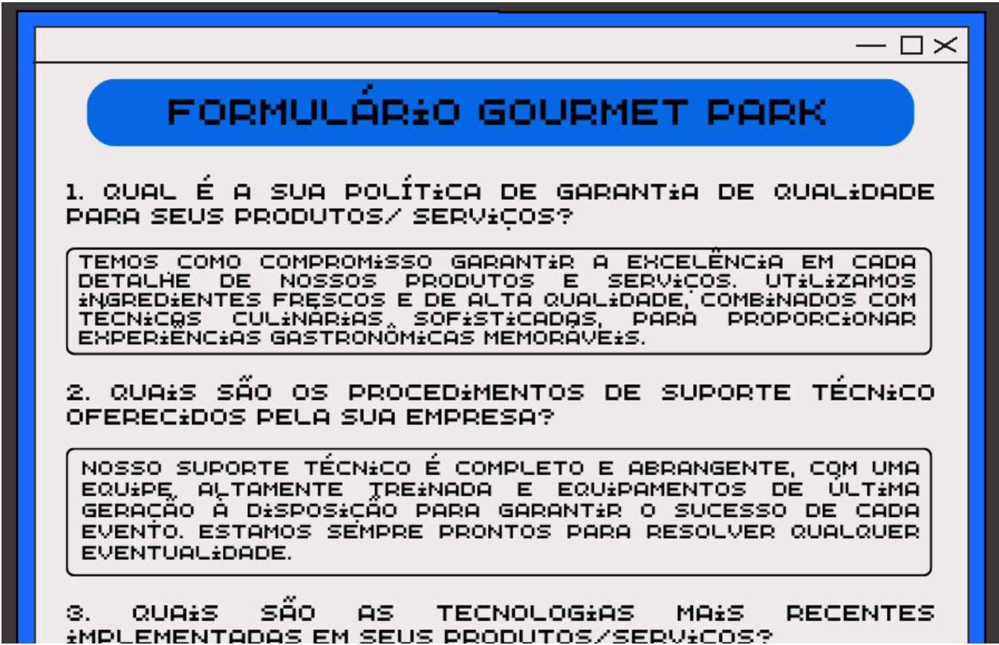
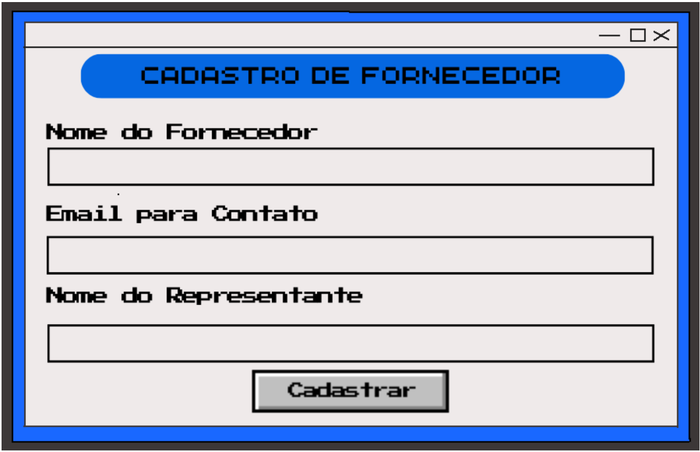

    

# GDD - Game Design Document - Módulo 1 - Inteli

## Grupo 4 - Metódicos

#### Nomes dos integrantes do grupo
- <a href="https://www.linkedin.com/in/anaeloisafacanha/">Ana Eloisa da Silva Façanha</a>
- <a href="https://www.linkedin.com/in/danielaraujogon%C3%A7alves/">Daniel Augusto de Araújo Gonçalves</a>
- <a href="https://www.linkedin.com/in/felipe-zillo-72b367247/">Felipe Gutierres Zillo</a> 
- <a href="">Gabriel Bacci Toledo</a> 
- <a href="https://www.linkedin.com/in/giovanna-britto/">Giovanna Fátima de Britto Vieira</a> 
- <a href="https://www.linkedin.com/in/gustavo-dacosta/">Gustavo Gonçalves da Costa</a>
- <a href="">Larissa dos Santos Temoteo</a>

## Sumário

[1. Introdução](#c1)

[2. Visão Geral do Jogo](#c2)

[3. Game Design](#c3)

[4. Desenvolvimento do jogo](#c4)

[5. Casos de Teste](#c5)

[6. Conclusões e trabalhos futuros](#c6)

[7. Referências](#c7)

[Anexos](#c8)

 

# 1. Introdução

## 1.1. Escopo do Projeto

### 1.1.1. Contexto da indústria

A Meta é uma empresa que tem como missão dar às pessoas o poder de criar comunidades e aproximar o mundo, dessa forma, eles desenvolvem produtos voltados para o mercado digital, resolvem problemas e trabalham juntos para conectar pessoas do mundo todo. Além disso, essa empresa possui um caráter social, logo possui ações voltadas para a diversidade, inclusão de todos e preocupação com o bem-estar dos seus funcionários (META, 2024).

Tendo como princípios dar voz às pessoas, criar conexão e comunidade, servir a todos, manter as pessoas seguras, proteger a privacidade e promover oportunidade econômica, a Meta atingiu 3 bilhões de usuários em todo o mundo e se tornou uma das cinco grandes empresas de tecnologia, em conjunto com a Microsoft, Amazon, Apple e Google (META, 2024).

Em 2004 foi lançado o Facebook, após isso, a cartela de produtos da Meta aumentou e incluiu aplicativos como o Messenger, o Instagram e o WhatsApp. Atualmente, a Meta está expandindo os negócios e indo em direção a experiências imersivas com realidade aumentada, virtual e mista (META, 2024). Em decorrência da vasta gama de produtos e serviços, a Meta acumulou uma série de concorrentes (tabela abaixo).

Figura 1 - Tabela de Concorrentes da Meta

Fonte: Material produzido pelos autores (2024)

Entretanto, apesar da vasta quantidade de concorrentes, em fevereiro de 2024 as ações da Meta dispararam e a empresa teve o maior ganho em valor de mercado em um único dia. As ações da Meta subiram 20,3% e esse ganho acrescentou US$ 206 bilhões em valor de mercado, o que fez com que a empresa se destacasse no cenário mundial e se consagrasse como a 34º posição entre as maiores empresas do globo .

#### 1.1.1.1 Análise das 5 Forças de Porter

A Meta é considerada uma das líderes no cenário da indústria tecnológica, operando em um mercado caracterizado por uma concorrência acirrada. Logo, para uma análise aprofundada do contexto desse setor, é preciso recorrer a uma ferramenta de análise estratégica reconhecida, como o modelo das 5 Forças de Porter.

Conforme apresentado por Magretta (2019), para que uma empresa/organização avalie ou formule uma estratégia de mercado é preciso utilizar a estrutura das cinco forças, essa estrutura foi formulada por Michael Porter e fornece parâmetros para medir o desempenho superior e foca na competição a ser enfrentada. Além disso, essa ferramenta busca entender o que acontece em determinado setor, fornecendo uma visão clara e direta que está relacionada com a lucratividade do mercado.

Para obter uma análise completa, as cinco forças de Porter se dividem em ameaça de entrada de novos concorrentes, ameaça de produtos substitutos, poder de negociação dos clientes, poder de negociação dos fornecedores e rivalidade entre os concorrentes (PORTER, 1896). Elas são:

1. **Ameaça de entrada de novos concorrentes:** Consiste nas métricas de entrada no setor. Quanto mais difícil for a entrada, menor é a concorrência e maior a probabilidade de lucros a longo prazo. Segundo Porter (1896), as barreiras que dificultam a entrada de novos concorrentes são: economias de escala, diferenciação de produto, exigências de capital, custo de troca, acesso aos canais de distribuição, desvantagem de custos e políticas governamentais (NAKAGAWA, [20--]).

2. **Ameaça de Produtos Substitutos:** Refere-se à facilidade com que o comprador pode substituir um tipo de produto ou serviço por outro (NAKAGAWA, [20--]).

3. **Poder de Barganha dos Compradores:** Refere-se à influência dos clientes em relação ao preço de aquisição do produto. É considerado alto quando os clientes compram em grandes volumes, têm interesse em economias e estão preocupados com a qualidade do produto adquirido (NAKAGAWA, [20--]).

4. **Poder de Barganha dos Fornecedores:** É definido pelo poder de negociação em insumos de produção e disponibilidade de materiais. Os fornecedores são considerados poderosos quando não têm que lutar contra outros produtos substitutos, não dependem dos compradores e possuem produtos únicos e insubstituíveis para os compradores (NAKAGAWA, [20--]).

5. **Rivalidade entre os Concorrentes Existentes:** Define o nível de competição em um setor. É mais intenso quando o número de empresas competindo é grande e quando as empresas sofrem restrições de tempo para venda do produto (NAKAGAWA, [20--]).

Utilizando os conceitos discutidos, é possível aplicar a estrutura das 5 Forças de Porter à Meta para avaliar sua posição competitiva e identificar os principais impulsionadores de lucratividade e os desafios enfrentados pela empresa.

Figura 2 - Análise das Cincos Forças de Porter

Fonte: Material produzido pelos autores (2024)

1. **Ameaça de produtos substitutos:** A ameaça de produtos ou serviços substitutos na indústria da Meta pode ser moderada a alta. Com a rápida evolução da tecnologia, sempre há o risco de que novas tecnologias ou abordagens possam substituir as soluções oferecidas pela Meta. Por exemplo, avanços em realidade virtual/aumentada, inteligência artificial ou outras áreas podem mudar as preferências dos consumidores ou oferecer alternativas mais eficazes.

2. **Poder de negociação dos compradores:** O poder de negociação dos compradores na indústria da Meta pode ser significativo. Os clientes têm várias opções de provedores de serviços semelhantes no mercado, o que lhes dá a capacidade de escolha. Se os clientes são grandes organizações ou têm forte influência no mercado, eles podem pressionar por preços mais baixos ou melhores termos de contrato.

3. **Rivalidade entre os concorrentes:** A rivalidade entre os concorrentes existentes na indústria da Meta é alta. A competição é intensa em setores como tecnologia e serviços relacionados, com várias empresas, como TikTok e Telegram, lutando por participação de mercado. Isso pode levar a pressão sobre preços, inovação acelerada e esforços de marketing agressivos para conquistar e manter clientes.

4. **Poder de negociação dos fornecedores:** No setor em que a Meta opera, o poder de negociação dos fornecedores pode ser moderado. Se a Meta depende de fornecedores específicos para hardware, software ou serviços essenciais, esses fornecedores podem exercer algum poder devido à sua posição de fornecimento chave. No entanto, se houver muitos fornecedores alternativos ou se a Meta tiver integração vertical em certas áreas, esse poder pode ser mitigado.

5. **Ameaça de entrada de novos concorrentes:** A ameaça de novos entrantes na indústria da Meta pode ser relativamente alta. Como a tecnologia está sempre evoluindo e novas startups podem surgir com ideias inovadoras, a entrada de novos concorrentes é uma possibilidade constante. No entanto, a Meta pode ter certa proteção devido a barreiras à entrada, como economias de escala, requisitos de capital significativos para desenvolvimento de tecnologia e marca estabelecida.

Conforme observado acima, a Meta possui grande relevância no mercado tecnológico. Entretanto, está presente em um mercado bastante competitivo, em que há uma evolução constante. Diante dessa perspectiva, a empresa, para manter-se como uma das líderes no mercado, deve sempre inovar em ritmo acelerado e investir em marketing substancial.

Em suma, as Cinco Forças de Porter oferecem uma estrutura abrangente para avaliar o ambiente competitivo de uma indústria e ajudam as empresas a desenvolver estratégias eficazes para superar dilemas e aproveitar oportunidades. Ao entender tais forças, a Meta pode posicionar-se de forma mais competitiva e realista em seu mercado-alvo.

### 1.1.2. Análise SWOT

A análise SWOT é uma ferramenta utilizada para identificar as forças, oportunidades, fraquezas e ameaças de uma empresa. Dessa forma, serve como uma forma de identificar oportunidades de melhoria frente à concorrência e à própria equipe, promovendo uma visão de qual o atual cenário da empresa (FILHO; ARAÚJO; QUINTAIROS, 2014).

No contexto da Análise SWOT, há os fatores internos e externos, quanto aos fatores internos há: as forças são as ações internas que oferecem uma vantagem competitiva para a empresa, são os fatores que indicam o sucesso da empresa. Enquanto as fraquezas são o oposto, são as iniciativas internas que estão abaixo do esperado e indicam o que precisa ser feito para melhorar na empresa (FILHO; ARAÚJO; QUINTAIROS, 2014).

Quanto aos fatores externos há as oportunidades e ameaças. As oportunidades são as iniciativas externas às empresas, mas que promovem uma melhor posição competitiva. Em relação às ameaças são os fatores externos que estão foram do controle da empresa e podem impactar negativamente o cenário competitivo (FILHO; ARAÚJO; QUINTAIROS, 2014).

Desse modo, considerando as concepções da Análise SWOT foi possível identificar as forças, fraquezas, oportunidades e ameaças que a contempla a Meta, conforme consta abaixo.

Figura 3 - Análise SWOT da empresa Meta

Fonte: Material produzido pelos autores (2024)

**Forças:**
- **Equipe qualificada e talentosa:** A empresa possui uma equipe altamente qualificada e talentosa, capaz de impulsionar a inovação e a excelência em seus produtos e serviços.  
- **Marketing e publicidade atraentes:** A empresa investe em estratégias de marketing e publicidade eficazes, que capturam a atenção do público-alvo e promovem o reconhecimento e a preferência de suas marcas e produtos.  
- **Marcas e produtos fortemente presentes:** A empresa possui marcas e produtos bem estabelecidos, com uma presença forte e influente no mercado, o que contribui para sua reputação e sucesso comercial.  
- **Presença de tecnologia de ponta nos serviços ofertados pela empresa:** A empresa oferece serviços que incorporam tecnologia de ponta, proporcionando aos clientes experiências inovadoras e de alta qualidade. 

**Fraquezas:**
- **Falta de otimização nos processos internos:** A empresa enfrenta desafios relacionados à falta de otimização em seus processos internos, o que pode afetar a eficiência operacional e a produtividade.

- **Dificuldade dos colaboradores em entender processos:** Os colaboradores enfrentam dificuldades em entender alguns processos internos da empresa, o que pode impactar negativamente a execução das tarefas e projetos.

- **Constantes comprometimentos na segurança dos dados:** A empresa enfrenta desafios relacionados à segurança dos dados, com ocorrências frequentes de comprometimento, o que pode resultar em perda de confiança dos clientes e danos à reputação da empresa.

- **Renda proveniente do sistema de anúncios:** A empresa depende significativamente da receita gerada pelo sistema de anúncios, o que a torna vulnerável a flutuações no mercado publicitário e mudanças nas políticas de privacidade.

**Oportunidades:**
- **Capacidade de influenciar grandes massas:** A empresa tem a capacidade de influenciar grandes audiências, dada sua presença significativa e impactante no mercado, o que representa uma oportunidade para expandir sua base de clientes e aumentar sua participação de mercado.

- **Capacidade de criar conexões com as mais diversas empresas e instituições:** A empresa possui recursos e alcance para estabelecer conexões com uma variedade de empresas e instituições, o que pode abrir oportunidades para colaborações estratégicas e desenvolvimento de novos produtos e serviços.

- **Possibilidade de explorar novos avanços tecnológicos:** A empresa está em posição de explorar e adotar novos avanços tecnológicos, o que pode impulsionar a inovação e a diferenciação de seus produtos e serviços no mercado.

- **Expandir o mercado:** A empresa tem a oportunidade de expandir seu alcance e penetração em novos mercados geográficos ou segmentos de mercado, o que pode impulsionar o crescimento e a diversificação de suas operações.

**Ameaças:**
- **Mercado com forte concorrência:** A empresa enfrenta uma forte concorrência no mercado, o que pode dificultar a manutenção ou aumento de sua participação de mercado e pressionar os preços e margens de lucro.

- **Economia global instável:** A instabilidade econômica global representa uma ameaça à empresa, pois pode afetar o poder de compra dos consumidores, as condições de crédito e investimento, e a demanda por seus produtos e serviços.

- **Perda de mercado devido a mudanças do consumidor:** Mudanças nas preferências e comportamentos dos consumidores podem levar à perda de participação de mercado da empresa, caso ela não consiga acompanhar ou antecipar essas mudanças de forma eficaz.

- **Riscos de segurança de dados:** A empresa enfrenta riscos significativos relacionados à segurança de dados, incluindo violações de dados, ataques cibernéticos e regulamentações cada vez mais rigorosas de proteção de dados, o que pode resultar em danos à reputação e custos significativos de conformidade e remediação.

Sendo assim, é notável que a análise SWOT da Meta oferece uma visão abrangente das forças, fraquezas, oportunidades e ameaças enfrentadas pela empresa. A Meta, anteriormente conhecida como Facebook, é uma gigante global que moldou a forma como interagimos e nos conectamos digitalmente. Com uma ampla gama de produtos em sua carteira e um marketing marcante, a empresa conquistou uma presença forte e influente em todo o mundo.

### 1.1.3. Descrição da Solução Desenvolvida

A Meta possui um processo para a contratação de fornecedores que perpassa diversas etapas, porém vários colaboradores desconhecem ou possuem dúvidas de partes desse processo. Então, objetivando solucionar esse problema foi idealizado a criação de uma ferramenta gamificada (jogo) com o intuito de capacitar os colaboradores acerca do processo supracitado.

Dessa forma os colaboradores da Meta terão acesso ao jogo para aprender de forma interativa, recebendo feedbacks e recompensas por meio da concusão de diversos desafios ao longo do jogo.

Sendo assim, é esperado o aumento do engajamento dos usuários devido à abordagem inovadora, promoção de uma assimilação fácil e assertiva do processo, redução dos erros cometidos ao longo do processo e o aumento na eficiência do treinamento, de forma a contribuir para o desenvolvimento dos colaborados e a eficácia do processo de contratação de fornecedores da Meta.

### 1.1.4. Proposta de Valor

O Canvas Proposta de Valor é uma ferramenta que tem como fundamento criar e posicionar produtos ou serviços de acordo com o que o cliente valoriza e precisa. Dessa forma, busca pensar no produto de uma forma mais estrutura e aumentar as chances de fazer o encaixe entre produto e mercado (PEREIRA, 2024).

Para atingir esse objetivo, a Proposta de Valor conta com dois blocos o Perfil do Cliente e a Proposta de Valor. Nesse primeiro, há a tarefa do cliente, as dores dos clientes e os ganhos dos clientes. Enquanto no segundo bloco estão presentes os produtos e serviços, os aliviadores de dores e os criadores de ganhos (PEREIRA, 2024).

Sendo assim, com o intuito de agregar valor na nossa solução e identificar quais as necessidades dos clientes desenvolvemos um Canvas Proposta de Valor, confome consta na imagem abaixo.

Figura 4 - Canvas da Proposta de Valor do Projeto

Fonte: Material produzido pelos autores (2024)

**Dores**
1. **Curva de Aprendizagem longa acerca do processo de contratação:** Os colaboradores podem enfrentar dificuldades para entender e assimilar o processo de contratação de fornecedores devido à sua complexidade e falta de recursos de treinamento adequados.

2. **Processos confusos e pouco didáticos:** A falta de clareza e eficácia nos materiais de treinamento pode levar à confusão e frustração entre os colaboradores.

3. **Frustração em um processo ineficiente:** A ineficiência no processo de contratação pode causar frustração e insatisfação entre os colaboradores, afetando negativamente o desempenho e a moral da equipe.

4. **Perda de potenciais fornecedores para a empresa:** Erros ou falta de compreensão do processo de contratação podem resultar na perda de fornecedores em potencial, prejudicando as relações comerciais e o crescimento da empresa.

5. **Processo de Contratação de fornecedores muito burocráticos:** A burocracia excessiva no processo de contratação pode desencorajar potenciais fornecedores e dificultar a eficiência operacional da empresa.

**Tarefas do Cliente**
1. **Processo de ensino para os colaboradores de uma forma tradicional:** Antes da implementação do jogo, os colaboradores eram treinados de maneira mais convencional, o que pode ser menos eficaz e envolvente.

2. **Engajar a equipe para participar do treinamento e os manter engajados:** Uma das tarefas dos gestores é garantir que os colaboradores participem ativamente do treinamento e permaneçam engajados ao longo do processo.

3. **Se manter curioso e engajado acerca do processo:** Os colaboradores também têm a responsabilidade de se manterem curiosos e interessados no processo de aprendizado, buscando constantemente melhorar suas habilidades e conhecimentos.

**Ganhos**
1. **Maior flexibilidade para o colaborador:** O treinamento gamificado oferece aos colaboradores a flexibilidade de aprender no próprio ritmo e no momento que for mais conveniente para eles.

2. **Maior autonomia e potencialização do aprendizado:** A abordagem do jogo permite que os colaboradores assumam o controle do seu próprio aprendizado, explorando e experimentando o conteúdo de forma independente.

3. **Sentimento de Pertencimento e valorização por parte dos funcionários:** Ao investir no desenvolvimento profissional dos colaboradores de forma inovadora, a empresa demonstra seu compromisso com o crescimento e o bem-estar da equipe, promovendo um ambiente de trabalho positivo e inclusivo.

4. **Entendimento do Processo de contratação de fornecedores:** O treinamento eficaz proporcionado pelo jogo ajuda os colaboradores a compreender e dominar o processo de contratação de fornecedores, permitindo que eles desempenhem suas funções com mais confiança e eficiência. 

**Criadores de Ganho**
1. **Aumento de Potenciais parceiros de negócio:** Implementar o jogo de treinamento pode atrair mais fornecedores interessados em trabalhar com a Meta, devido à reputação da empresa como inovadora e comprometida com o desenvolvimento de seus colaboradores.

2. **Colaboradores mais engajados e produtivos na empresa:** Um treinamento divertido e interativo pode aumentar o engajamento dos colaboradores, o que geralmente leva a um aumento da produtividade e satisfação no trabalho.

3. **Proporcionar um treinamento divertido e aprendizado ágil:** Ao transformar o processo de aprendizado em um jogo, os colaboradores podem absorver o conhecimento de forma mais rápida e eficaz, tornando o treinamento mais eficiente e agradável.

4. **Sanar dúvidas relacionadas ao processo de contratação:** O jogo oferece uma oportunidade para os colaboradores esclarecerem suas dúvidas de forma prática e interativa, facilitando a compreensão do processo de contratação.

**Aliviam as Dores**
1. **Diminuição da perda de potenciais fornecedores:** Ao fornecer um treinamento mais eficaz e envolvente, a empresa pode reduzir a perda de fornecedores devido a erros ou falta de compreensão do processo.

2. **Satisfação dos colaboradores:** Um treinamento mais atraente e eficaz pode aumentar a satisfação dos colaboradores, ajudando a reter talentos e reduzir a rotatividade.

3. **Maior retenção e entendimento acerca do processo:** A abordagem do jogo pode ajudar os colaboradores a reter e entender melhor o processo de contratação, reduzindo a confusão e os erros.

4. **Inovação tecnológica para melhor didática com os colaboradores:** Utilizar uma abordagem tecnológica e inovadora no treinamento pode tornar o processo mais acessível e eficaz para os colaboradores.

**Produtos e Serviços**
1. **Documento detalhando o processo de desenvolvimento do jogo:** Este documento fornecerá uma visão abrangente do processo de criação do jogo, incluindo todos os aspectos técnicos e de design.

2. **Jogo que possibilita o entendimento didático do processo de contratação de fornecedores da Meta:** O jogo é o produto final, projetado para oferecer aos colaboradores uma experiência de aprendizado imersiva e eficaz sobre o processo de contratação.

### 1.1.5. Matriz de Riscos

A Matriz de Risco é outra ferramenta que utilizada para a avaliar a probabilidade de determinados eventos ocorrerem e quais os impactos desse evento. Para isso, é proposto a construção de uma tabela que possui o eixo vertical como probabilidade e o eixo horizontal como impacto (MINISTÉRIO DO PLANEJAMENTO, DESENVOLVIMENTO E GESTÃO, 2017).

Sendo assim, a probabilidade indica o quão previsível é que um risco ocorra e qual a frequência que ele pode acontecer, enquanto o impacto indica as consequências quando o risco de fato acontece (MINISTÉRIO DO PLANEJAMENTO, DESENVOLVIMENTO E GESTÃO, 2017).

Dessa forma, a Matriz de risco serve para avaliar o potencial de risco na produção desse projeto e ajudar no planejamento de ações para evitar que esses ocorram.

Figura 5 - Matriz de Risco do Projeto

Fonte: Material produzido pelos autores (2024)

De acordo com os riscos estabelecidos foi possível determinar quais ações seriam tomadas para evitar que estes ocorressem e o que seria feito caso ocorressem.

Tabela 01 - Riscos e Plano de Ação

\# | **Plano de Ação e Resposta**
--- | ---
**Impasses gerados por ideias divergentes** | Entrar em consenso por meio do diálogo e reuniões
**Ausência de conhecimento técnico** | Buscar nivelar o mais proximo possivel os assuntos a serem abordados
**Divisão de tarefas ineficiente** | Construir um bom plano de ações e organizar os objetivos de maineira clara e simples sozinho ou em dupla
**Atraso nas entregas** | Buscar comprometimento e se atentar aos prazos
**Comunicação malsucedida** | Praticar escuta ativa e melhorar os meios de comunicação
**Falta de experiência com atividades que envolvam programação** | Buscar os conteudos de forma mais suscinta para  areas e coisas de interesse semelhante ao gosto do aluno
**Dificuldade com  gerenciamento socioemocional** | Aprender a lidar bem com suas emoções e da próximo, tendo sempre como princípio respeitar as individualidades
**Má gestão de tempo** | Fazer uso de um bom planejamento, adiantar trabalhos e objetivos para não dar janela para imprevistos
**Ausência por motivo de saúde** | Buscar manter uma alimentação e cuidados saudáveis como individuo para eviatar adoecimento biologico ou mental
**Dificuldade em assimilar o exercício proposto** | Tirar duvidas por meio de perguntas ou de outros exercícios semelhantes com ajuda de professor ou colegas

Fonte: Material produzido pelos autores (2024)

## 1.2. Requisitos do Projeto

Durante a reunião com o parceiro do projeto foi possível definir uma série de requisitos que contemplam desde a estética até a mecânica do jogo.

Tabela 02 - Requisitos do Projeto

**Tabela de requisitos**
\# | **Requisito**  
--- | ---
1 | Garantir que os usuários estejam curiosos e ativos em relação aos processos de forma a reduzir os riscos na contratação.
2 | Garantir que o colaborador saiba o processo.
3 | Desconstruir a ideia que é um processo complicado e garantir um senso de responsabilidade.
4 | Jogo de curta duração (15 minutos aproximadamente).
5 | Interface prática de ser acessada com o máximo de inovação.
6 | Utilizar cases de exemplo.
7 | O jogo pode ter uma opção em inglês, mas o português deve ser priorizados;
8 | Ofertar tanto Mobile quanto para Computador.
9 | Possibilitar o compartilhamento da conclusão de fases do jogo.

Fonte: Material produzido pelos autores (2024)

## 1.3. Público-alvo do Projeto

O público-alvo representa um grupo de pessoas com características semelhantes, tornando-as mais propensas a consumir os produtos ou serviços de uma empresa que as têm como alvo (SEBRAE, [20--]).

Definir o público-alvo confere uma vantagem competitiva, direcionando a comunicação e o marketing da empresa, e impulsionando as vendas. No entanto, uma definição imprecisa ou muito abrangente pode resultar em conflitos, daí a importância de estabelecer gênero, idade, localização, profissão, escolaridade e outros aspectos relevantes (SEBRAE, [20--]).

Com o intuito de direcionar o projeto de forma precisa, a definição do público-alvo foi realizada. O Meta Supply, portanto, é direcionado a pessoas de todos os gêneros, raças e etnias, com idade acima de 18 anos, que trabalham como colaboradores da Meta. Além disso, são indivíduos que buscam se manter ativos e curiosos em relação aos processos da empresa, mas que podem se sentir confusos devido à complexidade de alguns deles.

Ademais, O público-alvo deste jogo é composto por pessoas responsáveis e comprometidas com a diversidade e representatividade em suas relações profissionais, engajadas em promover a diversidade cultural no cenário empresarial.

Outro aspecto relacionado ao público-alvo são as personas, que refletem a personalidade real de um cliente ideal que a empresa pretende alcançar, buscando uma definição mais sofisticada e personalizada que leve em conta informações objetivas e subjetivas, como medos, anseios, dores e sonhos que motivam o desejo por um produto ou serviço (SEBRAE, [20--]).

Com o objetivo de oferecer um produto (jogo) mais personalizado e centrado em "pessoas reais", foi definida uma persona.

**Persona do usuário:**

**Nome:** *Bruna Oliveira*  
**Idade:** *29*  
**Gênero:** *Feminino*  
**Cargo:** *Analista de Marketing da META*  

**Características:**  
- Curiosa 
- Criativa  
- Observadora  

**Biografia:**  
Bruna é uma analista de marketing da META, nascida em Minas Gerais e criada em São Paulo. Possui graduação em Marketing pela Universidade de São Paulo (USP) e pós-graduação em Marketing Digital pela Universidade Federal de Minas Gerais (UFMG). Destacou-se no gerenciamento de marketing de diversos e-commerces antes de ser contratada pela META, onde atualmente lidera uma equipe responsável por estratégias de melhoria da presença online da bigtech no Brasil.

**Dores:**  
- Falta de uma abordagem didática e prática para compreender os processos de contratação de fornecedores da META.
- Dificuldade em manter o foco e o engajamento ao longo de treinamentos tradicionais sobre o processo de contratação de fornecedores.

**Necessidades:**  
- Mecanismo que simplifique e promova o entendimento didático do processo de contratação de fornecedores, com aplicação prática do roadmap de um possível fornecedor até o término do contrato. 
- Treinamento mais divertido para manter sua atenção.

# 2. Visão Geral do Jogo

## 2.1. Objetivos do Jogo

Todo o processo de criação e desenvolvimento do jogo foi direcionado para permitir que os colaboradores da Meta compreendam todas as etapas do processo de contratação de fornecedores, mantendo-se ativos e curiosos para conhecer e entender o funcionamento da contratação. Assim, o jogo foi dividido em 11 fases, das quais duas foram sem interações.

O objetivo principal do jogo é executar a festa de lançamento do novo Meta Quest 4 e finalizar o contrato com o fornecedor selecionado de forma adequada. No entanto, para alcançar esse objetivo, é necessário passar por todas as fases do jogo, cada uma com seus próprios objetivos, que são os seguintes:

- **Fase 1 - Planejar, Avaliar e Selecionar:** escolher os quatro melhores serviços de buffet entre as oito opções disponíveis. 
- **Fase 2 - Due Diligence:** coletar informações sobre os fornecedores por meio de documentos ou entrevistas e selecionar os três melhores. 
- **Fase 3 - Acordo de confidencialidade:** completar o acordo de confidencialidade com as palavras que melhor se adequem à proposta. 
- **Fase 4 - Conhecendo o negócio:** esta fase não possui um objetivo específico, servindo apenas para orientar o jogador. 
- **Fase 5 - RFX:** criar um formulário com as melhores perguntas, encaminhar para os fornecedores e selecionar os dois melhores. 
- **Fase 6 - Cadastro em Sistemas Internos:** responder a um questionário de cadastro com as informações dos fornecedores. 
- **Fase 7 - Avaliação de Terceiros:** participar como jurado do julgamento dos dois fornecedores avaliados, escolhendo apenas um fornecedor. 
- **Fase 8 - Negociação de contratos:** estabelecer o preço do serviço, prazos de entrega e cláusulas de qualidade. 
- **Fase 9 - Ordem de Compra, Gerenciamento e Monitoramento e Nota Fiscal:** Emitir a ordem de compra, monitorar a festa e receber a nota fiscal. 
- **Fase 10 - Pagamento:** Apresentar a nota fiscal no banco e realizar a transferência do dinheiro para o Buffet. 
- **Fase 11 - Encerramento e Desligamento:** decidir se irá encerrar o contrato ou apenas arquivar a empresa. 

Portanto, ao concluir os objetivos de cada fase do jogo, também se alcança o objetivo final e o propósito do jogo, que é garantir que os colaboradores conheçam e assumam a responsabilidade pelas consequências de suas ações ao longo de cada fase do processo de contratação de fornecedores.

## 2.2. Características do Jogo

### 2.2.1. Gênero do Jogo

Desde a origem dos jogos digitais, uma ampla variedade de gêneros e subgêneros foi criada para incorporar inovações em mecânicas, câmeras e jogabilidade. Atualmente, essa diversidade abrange mais de 100 tipos distintos, incluindo, entre outros, ação, aventura, luta, corrida, Role-Playing, simulação, estratégia, esportes, parlor e massive multiplayer online (REINOSO; TEIXEIRA ; RIOS, 2020).

Considerando essa diversidade de gêneros, foi possível classificar o Meta Supply nos gêneros de Role-Playing Game (RPG), simulação e Puzzle e Party Game.

Os jogos de Role Playing Game são reconhecidos por suas narrativas envolventes, nas quais o jogador assume o controle de um ou mais personagens em primeira pessoa, enfrentando desafios e buscando alcançar objetivos específicos (PEREIRA, [20--]). Por outro lado, os jogos de simulação têm como objetivo reproduzir elementos do mundo real no ambiente digital. Por fim, os Puzzle e Party Games são caracterizados pela resolução de enigmas que variam desde desafios lógicos até perguntas diversas (VILLELA, 2021).

Assim, o jogador assume o papel de um único personagem em sua jornada, que consiste em simular o processo de contratação de um serviço de buffet para a empresa Meta, enquanto enfrenta desafios de lógica e quebra-cabeças. Esses elementos são integrados em uma narrativa cativante e envolvente, proporcionando uma experiência imersiva ao jogador.  

### 2.2.2. Plataforma do Jogo

Um computador é uma máquina que possibilita aos usuários realizar cálculos matemáticos, pesquisas e trabalhos utilizando programas específicos. Atualmente, uma variedade de tipos de computadores está disponível, sendo os mais comuns os desktops e os notebooks. Os notebooks se destacam pela sua portabilidade e leveza, possibilitando seu transporte para diferentes locais, ao passo que os desktops são estacionários, fixos na mesa(ESESP, 2018).

Além disso, temos a World Wide Web, conhecida como Web, que é uma rede de computadores na Internet que oferece informações em forma de hipertexto. Ela proporciona uma representação virtual do mundo real, permitindo aos usuários explorar lugares sem sair de casa, conectar-se e interagir com pessoas ao redor do globo, participar de comunidades e muito mais (MORAIS; LIMA; FRANCO, 2012).

Diante desses conceitos, o jogo Meta Supply será desenvolvido para dispositivos desktop e notebooks, utilizando sistemas operacionais web. Essa abordagem visa facilitar o acesso ao jogo, garantir um desempenho de processamento otimizado e evitar possíveis travamentos durante a jogabilidade.

### 2.2.3. Número de jogadores

Com a proposta de oferecer uma experiência única e personalizada a cada jogador, o jogo foi concebido para ser jogado individualmente, permitindo que o colaborador desenvolva e demonstre suas habilidades de forma individualizada. Nesse sentido, cada partida será destinada a apenas um jogador, que poderá escolher entre diversos personagens e interagir com os personagens não jogáveis ao longo do jogo.

### 2.2.4. Títulos semelhantes e inspirações

Para desenvolver o jogo Meta Supply, foram utilizados diversos jogos eletrônicos como fonte de inspiração, tanto para os desafios quanto para o design do jogo, incluindo títulos como "Habbo", "The Sims" e "Among Us".

"**Habbo**" é um jogo de simulação no qual os jogadores podem criar avatares, fazer amizades, construir quartos e desenvolver jogos. Ele oferece uma comunidade vibrante onde os jogadores podem expressar sua criatividade e originalidade, sendo acessível via web em computadores (HABBO, [20--]).

Da mesma forma, "**The Sims**" é outro jogo de simulação que busca simular a vida real, permitindo que os jogadores construam suas casas, construam carreiras, formem famílias e interajam com outros jogadores ao redor do mundo. Ele também enfatiza a diversidade e a personalização dos personagens conforme as preferências do jogador (ARTS, [20--]).

Por fim, "**Among Us**" apresenta uma jogabilidade simples e é conhecido por sua capacidade de conectar grupos de amigos. Nele, os jogadores devem realizar tarefas em uma nave espacial enquanto tentam descobrir quem são os impostores infiltrados, o que cria uma atmosfera de suspense e intriga. A interatividade proporcionada pelas tarefas simples é uma inspiração chave para o jogo Meta Supply (DIAS, 2021).

### 2.2.5. Tempo estimado de jogo

*Ex. O jogo pode ser concluído em 3 horas passando por todas as fases.*

*Ex. cada partida dura até 15 minutos*

# 3. Game Design

## 3.1. Enredo do Jogo

A Meta é uma empresa reconhecida por sua vasta gama de produtos e serviços oferecidos em todo o mundo, especialmente em Metaville, onde todos os cidadãos utilizam seus produtos ou serviços. Um dos principais objetivos da empresa é inovar constantemente para atender melhor seu público, o que motiva a equipe de produção a trabalhar arduamente para lançar continuamente novidades e tendências.

O processo de desenvolvimento de um produto ou serviço demanda tempo e dedicação, e todos os colaboradores se envolvem intensamente para garantir que todas as etapas sejam executadas corretamente. Como resultado, os colaboradores da empresa estão sempre focados em suas atividades.

O próximo lançamento em destaque é o novo Meta Quest 4, um óculos de realidade virtual que promete revolucionar o Metaverso e marcar um momento importante na história da empresa. No entanto, em meio a uma lista extensa de tarefas, ocorreu uma divisão na equipe de trabalho, e o jogador foi designado para organizar uma festa de lançamento memorável para todos os envolvidos.

Contudo, surge um problema: para realizar essa festa, é necessário contratar uma empresa de eventos ou um serviço de buffet e seguir todo o processo de contratação de fornecedores. Como o jogador estava concentrado em outras atividades, acabou não lendo o documento que explicava esse processo. Portanto, ele terá que embarcar em uma jornada guiada, enfrentando desafios e tomando decisões para alcançar o objetivo final.

## 3.2. Personagens

### 3.2.1. Controláveis

José (figura 6) cresceu em uma comunidade simples, na periferia da cidade de São Paulo, Brasil. Desde jovem, ele enfrentou obstáculos financeiros e sociais, mas sempre demonstrou uma incrível determinação e paixão por alcançar seus sonhos.

Figura 6 - José - Personagem do Jogo

Fonte: Material produzido pelos autores (2024)

Seu desejo de criar uma vida melhor para si mesmo e para sua comunidade o levou a se concentrar em seus estudos e buscar oportunidades de crescimento. Ao ingressar na faculdade, destacou-se em ciências da computação e programação. Sua habilidade excepcional chamou a atenção de uma empresa inovadora líder no desenvolvimento de soluções tecnológicas avançadas.

Embora o ambiente corporativo fosse novo ele trouxe consigo uma ética de trabalho inabalável e uma perspectiva única. Em sua jornada na Meta começou como estagiário, mas rapidamente com seu talento e dedicação foi promovido.

---

Esperanza (figura 7) nasceu e cresceu no interior da Espanha, saiu de sua cidade visando encontrar oportunidades no mercado de tecnologia e encontrar pessoas que fossem mais compreensivas e respeitosas em relação a condição da sua pele.

Figura 7 - Esperanza - Personagem do Jogo

Fonte: Material produzido pelos autores (2024)

Durante muito tempo de sua vida Esperanza sofreu preconceito, tanto pela sua cor de pele tanto por ter vitiligo, doença de pele que causa perda de coloração.

Desde sua adolescência ela teve interesse na área de RH, quando soube da oportunidade de trabalhar na Meta, ela decidiu se mudar para Meta Ville em busca de uma vida melhor

---

Taylor (figura 8), vinda do Texas, nos Estados Unidos, sempre possuiu condições financeiras favoráveis e sempre buscou utilizar essas oportunidades da melhor forma.

Figura 8 - Taylor - Personagem do Jogo

Fonte: Material produzido pelos autores (2024)

Taylor, sabendo de sua posição na sociedade, sempre buscou advogar pelos direitos das mulheres e das pessoas menos favorecidas, isso lhe rendeu diversas premiações e condecorações.

Ela entrou na Meta buscando administrar as campanhas da empresa relacionadas a diversidade, inclusão e respeito.

---

Klaus (figura 8) nascido em Berlim, na Alemanha, se mudou para a Áustria ainda na sua infância, apesar das boas condições financeiras, possuia relações familiares muito conturbadas, o que ocasionou sua mudança para a Áustria para morar com os avós ainda na infância.

Figura 8 - Klaus - Personagem do Jogo

Fonte: Material produzido pelos autores (2024)

Após a mudança de Klaus para a Áustria, ele sofreu um acidente ainda na sua infância que o levou a ter que amputar a perna, desde então ele utiliza uma prótese metálica que o auxilia a andar.

Ele entrou na Meta através de uma vaga de emprego exclusiva para pessoas com deficiência, da qual fazia parte do programa de diversidade da Meta.

### 3.2.2. Non-Playable Characters (NPC)
Para que haja fluidez no jogo, torna-se necessário ter NPC's que completem a história, visto que a interação humana é essencial para as mecânicas presente no game.

Tabela 03 - Relação dos Personagens em Nome, Local e Função

\# | Nome | Local | Função | Imagem
--- | --- | --- | --- | ---
1 | Anastasia | Tribunal | Realizar o julgamento |   
2 | Santiago | Escritório | Delegar as funções do jogador |    
3 | Abby | Buffet | Negociar com o jogador |   
4 | Steve | Buffet | Negociar com o jogador |   
5 | Aparecida | Buffet | Negociar com o jogador |   
6 | Aisha | Buffet | Negociar com o jogador |   

Fonte: Material produzido pelos autores (2024)

### 3.2.3. Diversidade e Representatividade dos Personagens
Em nosso jogo, reconhecemos a importância da representatividade e da inclusão, refletindo a diversidade da população brasileira e além. Cada personagem foi cuidadosamente desenvolvido para destacar diferentes origens, experiências e desafios enfrentados em suas jornadas individuais.

José, proveniente de uma comunidade simples na periferia de São Paulo, personifica a determinação e a superação de obstáculos socioeconômicos, inspirando-se em seu sucesso na ascensão profissional para uma vida melhor.

Esperanza, nascida na Espanha, traz consigo a experiência de lidar com preconceitos em relação à sua pele e à condição de vitiligo. Sua busca por oportunidades no campo da tecnologia reflete a perseverança diante das adversidades.

Taylor, vinda do Texas, destaca-se como uma defensora dos direitos das mulheres e das minorias, trazendo sua influência e experiência para administrar campanhas de diversidade e inclusão na Meta.

Klaus, nascido na Alemanha e vivendo na Áustria após um acidente que resultou na amputação de sua perna, representa a resiliência das pessoas com deficiência. Sua inclusão na Meta através do programa de diversidade destaca o valor da igualdade de oportunidades.

Manuela e Sofia, representando mulheres negras, trazem à tona os desafios enfrentados devido ao machismo e ao racismo estruturais na sociedade brasileira. Suas histórias ressaltam a importância de reconhecer e combater as barreiras impostas pela discriminação.

Dessa forma, ao escolher um personagem para jogar, os jogadores são convidados a refletir sobre a diversidade de experiências e a reconhecer que todos têm o potencial de alcançar grandes conquistas, independentemente de sua origem, raça, gênero ou condição física. A inclusão de uma variedade de nomes e características físicas visa demonstrar a riqueza da diversidade e promover a empatia e a compreensão entre os jogadores.

## 3.3. Mundo do jogo

### 3.3.1. Locações Principais e/ou Mapas

Conforme dados fornecidos pela Meta, sua sede principal está localizada em Menlo Park, Califórnia. A partir dessa informação, uma série de estudos sobre a cidade foi conduzida, e os resultados dessas pesquisas serviram de inspiração para a construção de Metaville, a cidade fictícia onde o jogo se passa.

Menlo Park está situada no condado de San Mateo e foi fundada em 1854 por dois empresários que investiram na construção de uma ferrovia, posteriormente adquirindo vastas extensões de terra na região e contribuindo para o estabelecimento de uma comunidade ao redor da estação ferroviária. Hoje em dia, Menlo Park é caracterizada por seus bairros encantadores, arborizados e diversos distritos comerciais (CITY OF MENLO PARK, [20--]).

Além disso, os moradores do distrito representam uma variedade de origens, são bem-educados e engajados na vida comunitária, desfrutando dos parques e instalações recreativas da cidade. O centro da cidade oferece uma variedade de lojas e restaurantes exclusivos, com ambientes agradáveis e voltados para pedestres (CITY OF MENLO PARK, [20--]).

Menlo Park também é reconhecida como a "Capital do Capital de Risco", pois desempenha um papel fundamental no fomento e no desenvolvimento de novas tecnologias e mercados provenientes do Vale do Silício (CITY OF MENLO PARK, [20--]).

Com base em todas essas características de Menlo Park, foi concebida Metaville, uma cidade fictícia tranquila e pacífica, repleta de estabelecimentos comerciais, locais de interesse e, notavelmente, a sede de uma das maiores empresas de tecnologia do mundo: a Meta. Conforme retratado no mapa da cidade (ver figura abaixo), Metaville possui áreas residenciais, comerciais e uma variedade de parques e atrações culturais para seus habitantes.

Figura 9 - Mapa Principal

Fonte: Material produzido pelos autores (2024)

Além disso, no mapa há estabelecimentos que são interativos, ou seja, que o usuário pode acessar, e aqueles que apenas compõem o cenário. As locações que os jogadores poderão acessar são:  
a) Escritório da Meta; 
b) GourmetPark;  
c) SaborVille; 
d) Metaville Fest; 
e) GulaVIP;  
f) Meta Bank;  
g) Tribunal;  

Figura 10 - Mapa Principal referenciado com as locações

Fonte: Material produzido pelos autores (2024)

Esses locais foram divididos de forma que o jogador pudesse passar em cada um dos 4 cantos do mapa de acordo com a fase do jogo em que ele está. O jogador irá iniciar o jogo dentro do escritório da meta (a), na segunda fase ele terá que passar por todos os serviços de buffet (b, c, d, e), as próximas quatro fases ocorrem dentro do escritório da Meta, enquanto a sétima ocorre no tribunal (g), perto da finalização do jogo, na oitava fase o jogador irá até um dos buffets, na nona volta para o escritório, na décima ele irá até o banco (f) e para finalizar o jogo, o jogador poderá estar em qualquer lugar do mapa para realizar o encerramento. 

Dessa forma, cada um dos locais interativos ou que o jogador poderá acessar possui um mapa próprio, ou seja, o escritório da Meta, os buffets, o banco e o tribunal possuem o seu próprio mapa. O primeiro mapa é o do escritório da Meta (figura abaixo), que foi inspirado em elementos dos escritórios da Meta ao redor do mundo. 

Figura 11 - Escritório da Meta em Metaville

Fonte: Material produzido pelos autores (2024)

A construção desse mapa iniciou pelo piso, que foi feito em tons de cinza e formato quadriculado, assim como os escritórios da Meta em Westlake, Boston, Chicago e Dublin (META, 2024). Além disso, na maioria dos escritórios da empresa há espaços para recreação dos funcionários, assim foi utilizado no mapa os formatos de sofás mais parecidos com os sofás do The Bowl - MPK 21 e do escritório em Dublin (META, 2024).  

No mapa acima também há estantes com livros, assim como no escritório de Chicago, também há os computadores dos colaboradores que foram inseridos em bancadas compartilhadas como no escritório de engenharia da Meta em Boston e há uma sala de reunião inspirada na sala de conferência da Meta em Tel Aviv. Ademais, foi observado na Meta em Chicago e em Boston uma copa com alimentos, bebidas, máquinas de café e de comida, logo foram inseridos esses elementos no mapa. Por fim, o quadro presente na sala de reunião do mapa foi uma representação dos escritórios em Westlake, Boston e Tóquio que possuem ao menos uma parede pintada com cores marcantes (META, 2024).

Além disso, os assets utilizados para a construção desses cenários foram: Modern Interiors, Modern Office e Modern Exteriors, que foram produzidos por LimeZu.

### 3.3.2. Navegação pelo mundo

Conforme apresentado na seção 3.3.1, o jogo se passa em Metaville, uma cidade fictícia, e para o jogador andar pelo mundo é necessário utilizar as setas do teclado para ir para cima, para baixo, para a esquerda ou para a direita. O jogador sempre inicia a partida pelo escritório da Meta, porém pode andar livremente pelo mapa.

Além disso, o jogo foi organizado em 10 fases e o jogador só passa de fase quando concluir corretamente o desafio da fase em que ele está, não podendo pular ou avançar sem ter concluído a tarefa. Sendo assim, cada fase possui uma task que o jogador precisa concluir para ganhar o jogo, essas tarefas são:

- *Fase 1: Escolher os quatro melhores fornecedores entre os seis disponíveis no computador do escritório, por meio de um jogo de seleção.*

- *Fase 2: Conversar com o representante de cada um dos quatro buffets selecionados, e responder um questionário de alternativa sobre quais buffets atendem aos requisitos necessários.*

- *Fase 3: Completar um acordo de confidencialidade de forma correta com base nas palavras que foram disponibilizadas para o jogador (encaixar as palavras no texto apresentado).*

- *Fase 4: Por meio de um questionário de alternativa o jogador deverá escolher as perguntas mais relevantes para a criação de um formulário, após um tempo o colaborador deverá analisar a resposta  e selecionar as duas melhores respostas.*

- *Fase 5: Completar um formulário de cadastro com as informações dos fornecedores dadas no formulário da fase anterior;*

- *Fase 6: Atuar como jurado do julgamento dos fornecedores no tribunal da cidade, tendo que selecionar apenas um fornecedor.*

- *Fase 7: por meio de um puzzle de ligar, o jogador deverá definir qual o preço, prazo de entrega e cláusulas de qualidade do serviço.*

- *Fase 8: No computador do escritório, o jogador deve emitir a ordem de compra e depois acompanhar a festa, garantindo que receberá a nota fiscal.*

- *Fase 9: Ir até o banco e realizar a transferência do valor definido na fase 8, informando: número da agência, da conta e valor.*

- *Fase 10: Selecionar os botões de conclusão do jogo para finalizar o contato.*

Portanto, o jogador pode se movimentar livremente pela cidade, porém ele só conseguirá entrar dentro dos estabelecimentos se concluir as tarefas referentes a cada fase.

### 3.3.3. Condições climáticas e temporais

O jogo Meta Supply se passa em um cenário urbano que não possui mudanças climáticas, ou seja, o clima do jogo permanece fixo independente do local no mapa que o jogador se posiciona. Além disso, não há mudanças temporais, então o jogo não diferencia noite ou dia. Além disso, as mecânicas do jogo não consideraram o tempo, então cada jogador está livre para concluir cada fase no período mais conveniente.

Em resumo, o jogo não é afetado por condições climáticas e temporais, pois essas mecânicas permanecem constantes durante todo o jogo.

### 3.3.4. Concept Art

O Concept Art é uma expressão artística elaborada com o intuito de desenvolver o conceito estético de um projeto. Na prática, artes conceituais, como na sua tradução literal, são imagens visuais que definem todos os padrões a serem seguidos em um design, como formatos, personagens, layouts, cenários e objetos.

Sua criação tem papel significativo na parte visual das artes criativas, desempenhando uma pré-visualização do trabalho finalizado. Visto isso, foi desenvolvido as Concept Art para orientar a criação de cada cenário do jogo.

Tabela 04 - Concept Art dos Cenários

\# | Concept Art | Descrição
--- | --- | ---
1 |  | Na imagem, é possível visualizar, primeiramente, o visual externo do buffet, em que há uma construção  retangular com uma porta principal e uma logo circular. Abaixo, do lado esquerdo, há uma mesa para expor alimentos. Acima da mesa, há um lustre para expor a decoração. No lado direito, há uma mesa grande, onde estão expostas as louças disponíveis para locação.
2 |  | A imagem mostra, no canto superior esquerdo,  a logo do banco, representada por uma moeda com um cifrão no centro. Abaixo, há o nome do banco. No canto inferior esquerdo, há um caixa eletrônico. Do lado direito, é possível visualizar a mesa para atendimento, juntamente com um personagem da gerência. Abaixo, há o modelo da nota de dinheiro a ser utilizado no jogo. No canto inferior direito, é exibida a ideia da tela do jogo.
3 |  | A imagem traz a idealização do cenário da casa de festas composto por uma edificação retangular, em que há, no canto superior direito, uma mesa do DJ. Abaixo, o escritório. No canto inferior esquerdo, a mesa de presentes. No centro, a pista de dança. No canto inferior direito, o banheiro. Acima dele, o stand para tirar fotos com o nome e logo do fornecedor. Logo na entrada, há um elevador. Além disso, no canto superior direito da imagem, há uma exemplificação da decoração da festa expressa por uma bandeirola.
4 |  | O design conceitual do tribunal apresenta, no centro superior, a mesa do juiz. Ao lado esquerdo, há a mesa da oposição. Ao lado esquerdo, há a mesa da defesa. Abaixo da mesa do juiz, há a cadeira do julgado. Um pouco acima do centro, há a contensão que isola a área do julgamento. Abaixo da contensão, estão as cadeiras do público. Por fim, na parte inferior do centro, há a entrada do tribunal.
5 |  | A imagem apresenta um conjunto de cadeiras, computadores dentro de cubículos organizados do lado esquerdo do layout. No canto superior direito, há os banheiros. No canto inferior esquerdo, há o bebedouro. No lado superior direito da imagem, há a visão superior do escritório.
6 |  | A primeira imagem mostra como o mapa do game é organizado, as edificações são divididas numa matriz 3x3.

Fonte: Material produzido pelos autores (2024)

### 3.3.5. Trilha sonora 

Foram selecionadas músicas, predominantemente do gênero eletrônico lo-fi, para servirem como trilha sonora ambiente do jogo. Considerando a ausência de batalhas ou momentos de ação rápida dentro do jogo, optou-se por um estilo musical caracterizado por ritmos suaves e tranquilos. Essa escolha visa proporcionar ao jogador uma experiência relaxante durante sua partida.

Tabela 05 - Trilha Sonora do Jogo

\# | titulo | ocorrência | autoria
--- | --- | --- | ---
1 | Música de Fundo | Tela de início e cidade | Non copyright music
2 | Música de Fundo | Escritório | Massobeats
3 | Música de fundo | Banco | Prod. Riddiman
4 | Música de Fundo | Buffets | Non copyright music
5 | Música de Fundo | Tribunal | Massobeats

Fonte: Material produzido pelos autores (2024)

## 3.4. Inventário e Bestiário

### 3.4.1. Inventário

O jogo Meta Supply não possui um inventário de itens, uma vez que não existem itens capturáveis no jogo.

### 3.4.2. Bestiário

O jogo Meta Supply não possui bestiário, isso acontece porque não existe a necessidade de inimigos ou alguém para combater durante o jogo.

## 3.5. Gameflow (Diagrama de cenas) 

A narrativa do jogo além da contextualização da história do jogo é a sequência de eventos ocorridos durante a progressão dos jogadores, ou seja, são os eventos vividos pelos jogadores durante as atividades do jogo. Essas atividades são determinadas pelo fluxo do jogo ou gameflow (SILVA; SARMET; SILVINO, 2016).

Segundo Johnson e Wiles (2003), o Flow é um estado de concentração, prazer profundo e absorção total em uma atividade, logo pode gerar afeto positivo em quem joga. Dessa forma, a maioria das experiências de fluxo ocorre com atividades direcionadas a objetivos, delimitadas por regras e que exigem lógica e habilidade, então as atividades do fluxo devem proporcionar uma sensação de descoberta e criatividade (JOHNSON; WILES, 2010).

Adaptando os fluxos para os jogos, chega-se a um modelo formado por oito elementos principais: concentração, desafio, habilidades, controle, objetivos claros, feedback, imersão e social. Esses elementos estão intimamente inter-relacionados, já que o jogador deve ser habilidoso para realizar uma tarefa desafiadora e a tarefa deve ter objetivos claros para serem agradáveis de se realizar, de forma a resultar em um ambiente de total imersão (JOHNSON; WILES, 2010).

Dessa forma, objetivando criar um ambiente que proporcione diversão, imersão e desafios para os jogadores, cada fase possui tarefas que irão engajar os jogadores a continuarem avançando no jogo. Essas fases podem ser vistas nos fluxogramas abaixo:

Figura 12 - Fluxograma Fase de Introdução

Fonte: Material produzido pelos autores (2024)

Figura 13 - Fluxograma Fase 1

Fonte: Material produzido pelos autores (2024)

Figura 14 - Fluxograma Fase 2

Fonte: Material produzido pelos autores (2024)

Figura 15 - Fluxograma Fase 3

Fonte: Material produzido pelos autores (2024)

Figura 16 - Fluxograma Fase 4

Fonte: Material produzido pelos autores (2024)

Figura 17 - Fluxograma Fase 5

Fonte: Material produzido pelos autores (2024)

Figura 18 - Fluxograma Fase 6

Fonte: Material produzido pelos autores (2024)

Figura 19 - Fluxograma Fase 7

Fonte: Material produzido pelos autores (2024)

Figura 20 - Fluxograma Fase 8

Fonte: Material produzido pelos autores (2024)

Figura 21 - Fluxograma Fase 9

Fonte: Material produzido pelos autores (2024)

Figura 22 - Fluxograma Fase 10

Fonte: Material produzido pelos autores (2024)

Figura 23 - Gameflow (Diagrama de Cenas)

Fonte: Material produzido pelos autores (2024)

*Para visualizar o gameflow com maior visualização acesse o link:* [Gameflow](https://www.canva.com/design/DAF-ITBXSnk/iUkrm57NPnhxXbuA2iM1DQ/edit?utm_content=DAF-ITBXSnk&utm_campaign=designshare&utm_medium=link2&utm_source=sharebutton)

Além disso, para o desenvolvimento das primeiras cenas do jogo (cena do mapa da cidade e do escritório) foram estabelecidas algumas classes, que estão organizadas por meio de diagramas UML, conforme consta abaixo.

Figura 24 - Diagrama UML do Player

Fonte: Material produzido pelos autores (2024)

Figura 25 - Diagrama UML do Carousel

Fonte: Material produzido pelos autores (2024)

Figura 26 - Diagrama UML do LoadingScreen

Fonte: Material produzido pelos autores (2024)

Figura 27 - Diagrama UML da Cidade

Fonte: Material produzido pelos autores (2024)

Figura 28 - Diagrama UML da Cidade

Fonte: Material produzido pelos autores (2024)

## 3.6. Regras do jogo (sprint 3)

Conforme apresentado por Stutz (2020), as regras são a essência de um jogo e faz com que ele se diferencie de outros tipos de entretenimento. Uma regra é definida como algo que regula, dirige ou rege algo, forçando as pessoas a certos tipos de comportamentos e orientando quanto à forma de agir e se portar.

No contexto dos jogos, as regras colocam os jogadores dentro do mundo do jogo e limitam o seu comportamento às restrições específicas impostas pelas regras do jogo, dessa forma, as regras devem limitar as ações do jogador, ser explícita e inequívoca, ser compartilhadas, obrigatórias e repetíveis (STUTZ, 2020). 
	
Sendo assim, buscando proporcionar condições coerentes e um jogo atrativo e desafiador foram definidos as regras para cada uma das onze fases do jogo, sendo essas:

1. Regras da Fase 1 - Planejar, Avaliar e Selecionar:

- Os jogadores devem escolher os quatro melhores serviços de buffet entre as oito opções disponíveis.
- Cada jogador tem um número limitado de escolhas a fazer, de acordo com as regras específicas da fase.
- Os jogadores devem basear suas escolhas em critérios específicos, como qualidade, preço e disponibilidade.

2. Regras da Fase 2 - Acordo de Confidencialidade:
- Os jogadores devem completar o acordo de confidencialidade com as palavras que melhor se adequarem à proposta.
- As palavras escolhidas pelos jogadores devem refletir os termos do acordo de confidencialidade proposto.
- O acordo de confidencialidade deve ser concluído dentro de um limite de tempo específico.

3. Regras da Fase 3 - Due Diligence:

- Os jogadores devem coletar informações sobre os fornecedores por meio de documentos ou entrevistas.
- Cada jogador deve selecionar os três melhores fornecedores com base nas informações coletadas.
- As informações coletadas devem ser analisadas cuidadosamente antes da seleção dos fornecedores.

4. Regras da Fase 4 - Formulário RFP:
- Os jogadores devem criar um formulário com as melhores perguntas para enviar aos fornecedores.
- Cada jogador deve encaminhar o formulário para os fornecedores e selecionar os dois melhores com base nas respostas recebidas.
- As perguntas devem ser relevantes e abordar aspectos importantes do serviço oferecido pelos fornecedores.

5. Regras da Fase 5 - Cadastro em Sistemas Internos:
- Os jogadores devem responder a um questionário de cadastro com as informações dos fornecedores.
- As informações fornecidas pelos jogadores devem ser precisas e completas.
- O questionário deve ser preenchido dentro de um prazo determinado.

6. Regras da Fase 6 - Avaliação de Terceiros: 
- Os jogadores devem participar como jurado do julgamento dos dois fornecedores avaliados, de forma a restar apenas um fornecedor.
- Cada jogador deve avaliar os fornecedores com base em critérios específicos, como qualidade, confiabilidade e custo.
- A avaliação dos fornecedores deve ser justa e imparcial.

7. Fase 7 - Negociação de Contratos:
- Os jogadores devem negociar o preço do serviço, prazos de entrega e cláusulas de qualidade com o fornecedor selecionado.
- Cada jogador deve buscar alcançar um acordo vantajoso para ambas as partes.
- As negociações devem ser conduzidas de forma ética e transparente.

8. Fase 8 - Ordem de Compra, Gerenciar e Monitorar, Nota Fiscal
- Os jogadores devem emitir a ordem de compra para o fornecedor selecionado e monitorar a execução do serviço.
- Cada jogador deve garantir que todos os termos do contrato sejam cumpridos pelo fornecedor.
- Os jogadores devem receber e arquivar a nota fiscal após a conclusão do serviço.

9. Fase 9 - Pagamento:
- Os jogadores devem apresentar a nota fiscal no banco e realizar a transferência do dinheiro para o fornecedor.
- O pagamento deve ser efetuado dentro do prazo estabelecido pelo contrato.
- Os jogadores devem garantir que o pagamento seja feito de forma correta e dentro das regulamentações financeiras.

10. Fase 10 - Encerrar e Desligar:
- Os jogadores devem decidir se irão encerrar o contrato ou apenas arquivar a empresa fornecedora.
- Cada jogador deve considerar os prós e contras de cada opção antes de tomar uma decisão.
- A decisão final deve ser tomada de acordo com os interesses e objetivos da empresa contratante.

Essas regras se encaixam no contexto de regras de processos e de temas, sendo assim, determinam a relação entre os procedimentos e os temas de implementação do jogo. Essas regras devem ser seguidas de forma a ajudar o jogador a progredir através do processo de contratação de fornecedores.

## 3.7. Mecânicas do jogo 

 Tabela 06 - Mecânicas do Jogo 

| **Mecânicas**                                                        | **Comandos**         | **Ação**                                                                   |
|----------------------------------------------------------------------|----------------------|----------------------------------------------------------------------------|
|  | Seta para a esquerda | Permite que o jogador se mova para a esquerda                              |
|  | Seta para a direita  | Permite que o jogador se mova para a direita                               |
|          | Seta para cima       | Permite que o jogador se mova para cima                                    |
|       | Seta para baixo      | Permite que o jogador se mova para baixo                                   |
|        | Barra de espaço      | Pode ser utilizada para interagir com objetos ou NPC's do mapa             |
|          | Mouse                | Pode ser utilizado como forma de seleção de itens e da interação com fases |

Fonte: Material produzido pelos autores (2024)

Para interagir com o mapa o jogador pode utilizar a barra de espaço, podendo ser utilizada para os seguintes usos:
- Interagir com NPC's (em livre tradução, personagens não jogáveis)
- Interagir com objetos ou partes do mapa
- Acelerar ou pular diálogos

Para interagir com certas fases ou concluir certos objetivos, o jogador poderá utilizar o mouse, podendo ser utilizado para os seguintes usos:
- Fazer a seleção de items
- Mover entre as opções
- Confirmar opções através da interação com botões

# 4. Desenvolvimento do Jogo

## 4.1. Desenvolvimento preliminar do jogo

Para o desenvolvimento preliminar no jogo foram realizados testes de cenários, escolhas de design e algumas diretrizes para o jogo. Nesses testes de cenário foram produzidos dois andares de um possível prédio da Meta, na primeira imagem(figura 30) consta uma sala da recepção para visitantes e na segunda (figura 31) consta o ambiente de trabalho dos colaboradores da empresa.

Figura 29 - Ambiente de Recepção

Fonte: Material produzido pelos autores (2024)

Figura 30 - Escritório dos Colaboradores da Meta

Fonte: Material produzido pelos autores (2024)

Quanto ao jogo preliminar foi utilizado um cenário mais limpo, que contém apenas o piso e as paredes do escritório, conforme consta na imagem abaixo.

Figura 31 - Cenário Preliminar do Game

Fonte: Material produzido pelos autores (2024)

Nesse último cenário foi adicionado um spritesheet de um personagem, conforme consta abaixo.

Figura 32 - SpriteSheet do Personagem

Fonte: Material produzido pelos autores (2024)

Para a movimentação do personagem foi realizado uma sequência de códigos, iniciando pela construção da página em HTML (figura 34), seguido das configurações do jogo em JavaScript (figura 35), da função de carregamento de objetos - Preload (figura 36), da função create para adicionar os objetos na cena (figura 37), da função update para garantir a interatividade e movimentação do personagem (figura 38).

Figura 33 - Código HTML

Fonte: Material produzido pelos autores (2024)

Figura 34 - Configurações do Jogo

Fonte: Material produzido pelos autores (2024)

Figura 35 - Função Preload

Fonte: Material produzido pelos autores (2024)

Figura 36 - Função Create

Fonte: Material produzido pelos autores (2024)

Figura 37 - Função Update

Fonte: Material produzido pelos autores (2024)

## 4.2. Desenvolvimento básico do jogo

Para o desenvolvimento básico do jogo, foi implementado os cenários da cidade e do escritório da empresa, além da transição de cenas entre esses mapas. Dessa forma, ocorreu uma divisão de pastas, sendo essas: classes, components e scenes. Cada uma dessas pastas, contém os arquivos para a execução do código. 

Nesse sentido, o código inicia pelo "index.html", que é responsável pela criação da tela do jogo, após isso, todos os elementos são criados e adicionados por meio do JavaScript e do Phaser. Além disso, para adicionar o personagem no jogo, foi criada uma classe player (figura 39), que define os parâmetros para criação do personagem.

Nesse aspecrto, cada parte do código em Phaser pode ser resumida em três métodos principais: preload, create e update. O preload é onde os recursos e imagens são carregados, o create é onde esses recursos são implementados na tela, enquanto no update são todas as atualizações que podem ocorrer durante o jogo. Dessa forma, ao longo dos códigos é possível identificar esses três métodos principais. 

Para atingir o objetivo principal do desenvolvimento básico do jogo, que consistia na implementação do mapa da cidade e do escritório, foram criados dois códigos: CityScene.js e OfficeScene.js, conforme consta abaixo.

Figura 38 - Método Preload do Player

Fonte: Material produzido pelos autores (2024)

Figura 39 - Método Create do Player 

Fonte: Material produzido pelos autores (2024)

Figura 40 - Método Update do Player

Fonte: Material produzido pelos autores (2024)

No primeiro arquivo, nomeado de CityScene, foi realizado a adiação do mapa da cidade. Nesse ínterim, a primeira parte do código há o preload, que carrega os assets utilizados para a construção do mapa e a spritesheet do personagem. Após isso, há o método create que adiciona os elementos anteriores na tela do jogo e adiciona as colisões e camadas no mapa. Por fim, no método update foram definidas as movimentações dos personagens pelo mapa.

Figura 41 - Método Preload da Cena da Cidade

Fonte: Material produzido pelos autores (2024)

Figura 42 - Método Create da Cena da Cidade

Fonte: Material produzido pelos autores (2024)

Figura 43 - Continuação do Método Create da Cena da Cidade

Fonte: Material produzido pelos autores (2024)

Figura 44 - Método Update da Cena da Cidade

Fonte: Material produzido pelos autores (2024)

Todos os códigos acima fizeram com que a seguinte cena fosse inserida no jogo:

Figura 45 - Cena da Cidade com o Personagem José

Fonte: Material produzido pelos autores (2024)

Figura 46 - Método Preload da Cena do Escritório

Fonte: Material produzido pelos autores (2024)

Além disso, para que o jogador pudesse acessar o escritório, foi criado outro arquivo e uma nova classe foi instanciada, na qual possui os métodos create, preload e update, que realiza as mesmas funções da classe da cidade. 

Figura 47 - Método Create da Cena do Escritório

Fonte: Material produzido pelos autores (2024)

O código acima permitiu que a cena do escritório fosse adicionada, conforme consta na imagem a seguir.

Figura 48 - Cena do Escritório com o Personagem José

Fonte: Material produzido pelos autores (2024)

Por fim, para garantir que as cenas fossem carregadas de maneira correta, de forma que a transição também ocorresse da melhor maneira, foi feita uma classe chamada LoadingScreen. Essa classe garante que as cenas criadas anteriormente pudessem ser transitadas.

Figura 49 - Método Preload do Carregamento de Cenas

Fonte: Material produzido pelos autores (2024)

Figura 50 - Continuação do Método Preload do Carregamento de Cenas

Fonte: Material produzido pelos autores (2024)

## 4.3. Desenvolvimento intermediário do jogo

Para a terceira fase do desenvolvimento do jogo foram estabelecidas como metas: o desenvolvimento da página inicial do game, o carrossel para a escolha do personagem do jogador, a implementação dos mapas dos quatro buffets, do banco e do tribunal, também foi estabelecido a implementação da primeira fase do jogo e a inserção da trilha sonora no jogo. Além disso, houve o início da segunda fase do jogo e da tela de conclusão da fase, com a opção de compartilhamento nas redes sociais. Dessa forma, a equipe foi dividida de forma a atender todas as metas estabelecidas. 

A primeira parte do desenvolvimento consistiu na criação da tela do jogo (figura 51), para isso criamos um design que contém elementos do mapa da cidade, o nome do jogo e o botão de start. A segunda parte do desenvolvimento foi a implementação do carrossel (figura 53), para isso foi utilizado o mesmo plano de fundo da tela de início, os assets dos personagens desenhados pela equipe, as setas para mudar as opções e o botão para confirmar a escolha.

Figura 51 - Tela Inicial do Jogo

Fonte: Material produzido pelos autores (2024)

Figura 52 - Tela do Carrossel do Jogo

Fonte: Material produzido pelos autores (2024)

Enquanto isso, também foram implementados os mapas dos quatro buffets (figura 54), do tribunal e do escritório (figura 55). Para acessar cada uma dessas construções é necessário atravessar a porta principal, e para sair também. Além disso, para realizar a primeira fase do jogo é preciso acessar um dos computadores que está no escritório da empresa, ao colidir com ele o jogador será direcionado para a tela da primeira fase do jogo (figura 56).

Figura 53 - Cena do Jogador nos Buffets da Cidade

Fonte: Material produzido pelos autores (2024)

Figura 54 - Cenas do Jogador no Tribunal e no Banco

Fonte: Material produzido pelos autores (2024)

Figura 55 - Cena da Primeira Fase do Jogo

Fonte: Material produzido pelos autores (2024)

Nessa primeira fase há oito cards com informações superficiais de cada buffet, ao clicar neles ocorre uma mudança de cor que indica a seleção desse buffet, ao selecionar os 4 buffets o jogador deve apertar o botão de analisar para verificar se escolheu corretamente, assim será emitido um feedback (figura 57 e figura 58) explicando o resultado - certo ou errado.

Figura 56 - Feedback Positivo

Fonte: Material produzido pelos autores (2024)

Figura 57 - Feedback Positivo

Fonte: Material produzido pelos autores (2024)

Para a trilha sonora, foi implementado uma música diferente para cada ambiente, então cada um dos cenários possui sua própria música e ao transitar entre esses espaços o jogador irá experienciar uma sensação diferente.

Além disso, para o desenvolvimento inicial da segunda fase do jogo (figura 59)  foi criado a tela do computador com os 4 buffets selecionados na fase anterior. Essa fase possui a mesma mecânica da primeira fase, então o jogador precisa clicar no card dos buffets para selecionar os 3 melhores.

Figura 58 - Cena da Segunda Fase do Jogo

Fonte: Material produzido pelos autores (2024)

Por fim, houve a criação da tela de compartilhamento (figura 60), essa parte do jogo serve para o jogador compartilhar nas suas redes sociais (Facebook, Instagram ou WhatsApp) que ele concluiu a fase. Entretanto, apesar de já estar criada, essa parte ainda não foi implementada no código do jogo.

Figura 59 - Tela de Compartilhamento

Fonte: Material produzido pelos autores (2024)

## 4.4. Desenvolvimento final do MVP (sprint 4)

Na penúltima fase do desenvolvimento do projeto foi definido como objetivos o desenvolvimento e a implementação de todas as fases do jogo, dessa forma cada membro da equipe ficou responsável pelo design e programação dessas fases e depois ocorreu a conexão delas, seguindo a ordem estabelecida pelo game. 

Para a segunda fase do jogo (acordo de confidencialidade) foi criado uma nova mecânica, na qual o jogador deve arrastar as palavras que estão na lateral esquerda da tela para a lateral direita de forma a completar o acordo de confidencialidade, se o jogador errar o local correto do texto o bloco de palavra volta para o seu local de origem e caso o jogador acerte a palavra fica fixa no texto, confome pode ser visto na figura abaixo.

Figura 60 - Segunda Fase do Jogo: Acordo de Confidencialidade

Fonte: Material produzido pelos autores (2024)

No desenvolvimento intermediário do jogo houve o desenvolvimento da terceira fase, entretanto o seu design foi reformulado (figura 61) e uma nova lógica de programação foi definida, dessa forma, o jogador só pode analisar as suas escolhas após selecionar  3 buffets e para realizar esse controle foi implementado na tela do jogo um contador que mostra para o jogador quantos buffets foram selecionados em comparação com o total de buffets. 

Figura 61 - Reformulação da Terceira Fase do Jogo

Fonte: Material produzido pelos autores (2024)

Quanto a quarta fase (formulário RFP) houve um reaproveitamento de mecânicas, isso porquê o jogador deve criar um formulário e para isso ele deve selecionar qual a melhor pergunta entre as alternativas disponíveis (figura 62), após isso o jogador é direcionado para uma cena em que irá visualizar o formulário final e enviar para os buffets (figura 63). Assim que o formulário for enviado o jogador poderá ver as respostas de cada buffet (figura 64), nessa cena uma nova mecânica de rolamento de tela foi implementada, ou seja, o jogador pode usar o "scroll" para visualizar o formulário de respostas (figura 65). Além disso, outras mecânicas implementadas foram: selecionar "esc" no teclado para voltar na cena anterior e selecionar "enter" para escolher qual o melhor buffet.

Figura 62 - Minigame para Criação do Formulário RFP

Fonte: Material produzido pelos autores (2024)

Figura 63 - Visualização e envio do Formulário Final

Fonte: Material produzido pelos autores (2024)

Figura 64 - Visualizar as respostas de cada buffet

Fonte: Material produzido pelos autores (2024)

Figura 65 - Visualizar as respostas de cada buffet

Fonte: Material produzido pelos autores (2024)

Além disso, ainda nessa fase, o jogador deve fazer o cadastro desses fornecedores no sistema interno da empresa (figura 66), então foi implementado três entradas de texto, de forma que o jogador deverá escrever o nome do buffet, o seu email e o nome para contato na empresa. 

Figura 66 - Cadastro em Sistemas Internos

Fonte: Material produzido pelos autores (2024)

Para o desenvolvimento do minigame da sexta fase foi desenvolvido uma cena para escolher qual o melhor buffet entre as duas opções disponíveis (figura 67), dessa forma há dois botões na tela sendo um para "curtir" o fornecedor e outro para recusar.

Figura 67 - Fase 6: Recusar ou Curtir um Buffet

Fonte: Material produzido pelos autores (2024)

Já para a sétima fase (figura 68) que tem como objetivo fazer a negociação do contrato com o fornecedor escolhido foi criado um puzzle de ligar, dessa forma a mecânica implementada consiste em clicar no círculo do lado esquerdo e puxar a ligação até o círculo do lado direito, de forma a criar as conexões corretas, caso o jogador erre uma conexão a linha volta para o seu estado inicial e se o jogador acertar a ligação fica fixa. 

Figura 68 - Fase 7: Negociação de Contrato

Fonte: Material produzido pelos autores (2024)

Enquanto isso, na fase 8 foram implementados 3 botões em que cada um direciona para uma cena diferente (figura 69), o primeiro ensina para o jogador o que é uma ordem de compra (PO), o segundo mostra a PO gerada pela contratação do serviço e o terceiro botão leva o jogador para a festa de lançamento do novo Meta Quest 4 (figura 70).

Figura 69 - Fase 8: Ordem de Compra

Fonte: Material produzido pelos autores (2024)

Figura 70 - Mapa da Fetsa

Fonte: Material produzido pelos autores (2024)

Na penúltima fase do jogo (figura 71), houve outro reaproveitamento de mecânica, já que o jogador deve inserir as informações para realizar o pagamento do serviço realizado, dessa forma há três entradas de texto (agência, conta e valor) e um botão para confirmar o pagamento. 

Figura 71 - Fase 9: Pagamento

Fonte: Material produzido pelos autores (2024)

Por fim, na última fase do jogo (figura 72), há uma tela com dois botões, e independente do botão que o jogador clicar irá encerrar o jogo.

Figura 72 - Fase 10: Finalização do Jogo 

Fonte: Material produzido pelos autores (2024)

## 4.5. Revisão do MVP (sprint 5)

*Descreva e ilustre aqui o desenvolvimento dos refinamentos e revisões da versão final do jogo, explicando brevemente o que foi entregue em termos de MVP. Utilize prints de tela para ilustrar.*

# 5. Testes 

## 5.1. Casos de Teste

Em resumo, os casos de teste são testes que serão aplicados ao jogo com o objetivo de evitar erros e confirmar que tudo está funcionando como deveria. Eles são compostos por uma pré-condição, uma descrição do teste e uma póscondição, sendo cada um desses tópicos descritivos do teste, demonstrando para que ele serve, como ele pode ser aplicado no jogo, e qual efeito ele busca reproduzir.

 Tabela 07 - Casos de Teste 

\# | pré-condição | descrição do teste | pós-condição
--- | --- | --- | ---
1 | Início do jogo | Iniciar o jogo na tela de menu | O jogador deve selecionar uma das opções da tela de menu
2 | Escolha de personagens | Através de um carrossel, o jogador poderá escolher o personagem que ele quer jogar | O jogador deverá ter escolhido o personagem que ele irá utilizar durante o jogo
3 | Botão de start | Após a seleção do personagem, o jogador deve clicar em um botão de “Start” | Após clicar no botão, o jogador deve ser levado a próxima cena
4 | Tutorial | Antes de efetivamente iniciar o jogo, um tutorial mostrando os comandos do jogo é mostrado | O jogador deve entender como jogar e finalizar o tutorial
5 | Ir para a fase | Transição de cenas entre a inicialização do jogo e o começo da primeira fase do jogo | Efetivamente iniciar o jogo e permitir que o usuário jogue
6 | Andar pelo mapa com colisões | Liberdade de andar livremente pelo mapa ( exceto por certas áreas que só são desbloqueadas após certa ação) | O caso espera que o jogador interaja com certas áreas do mapa
7 | Entrar no elevador | Entrar no elevador com o objetivo de ir para outra área do mapa | Ir para outra cena do mapa
8 | Área de interação com o personagem | Garante que o usuário consiga interagir com os objetos ou outros personagens | Permite a interação entre jogador e objetos / personagens para continuação da história 
9 | Entrar no escritório | Troca de cenário ao passar pela porta do escritório | Mudar a cena para o escritório 
10 | Aparição da tela da primeira fase | Aparição da tela para seleção dos buffets da primeira fase assim que o jogador se aproximar do computador correto no escritório da Meta| Aparecer a tela da fase
11 | Seleção dos Buffets | Seleção dos buffets realizada pelo jogador | Deixar marcado os buffets selecionados
12 | Aparição da tela do fim da fase | Aparição da tela do fim da primeira fase, seja de erro, caso o jogador tenha errado, ou de conclusão | Aparição da tela final da primeira fase
13 | Entrar nos buffets | Troca o cenário ao chegar na porta dos buffets | Mudar a cena para o buffet
14 | Entrar no tribunal | Permite que o jogador entre no tribunal | Mudar a cena para o tribunal
15 | Entrar no banco | Torna possível o jogador entrar no banco presente no mapa da cidade | Mudar a cena para o banco
16 | Início da fase 2 | Iniciar a fase 2 do jogo | O jogador deve ser apresentado à mecânica de arrastar palavras para completar o acordo de confidencialidade
17 | Arrastar palavras corretamente | O jogador arrasta corretamente todas as palavras para completar o acordo | As palavras ficam fixas no acordo e o jogador avança para a próxima fase
18 | Arrastar palavras incorretamente | O jogador arrasta uma palavra para o local errado no acordo | A palavra volta para a posição original e o jogador continua a tentar completar o acordo
19 | Início da fase 3 | Iniciar a fase 3 do jogo | O jogador deve ver a lista de buffets disponíveis e um contador indicando as seleções feitas
20 | Selecionar buffets corretamente | O jogador seleciona 3 buffets corretamente | O jogador avança para a próxima fase e vê as suas escolhas
21 | Selecionar buffets corretamente | O jogador seleciona 3 buffets corretamente | O jogador avança para a próxima fase e vê as suas escolhas
22 | Contador de buffets selecionados | O jogador seleciona mais de 3 buffets | O contador mostra 3 buffets selecionados e o jogador não pode avançar até corrigir a seleção
23 | Início da fase 4 | Iniciar a fase 4 do jogo | O jogador deve selecionar a melhor pergunta para o formulário RFP
24 | Criar formulário corretamente | O jogador seleciona as melhores perguntas e avança para a visualização do formulário final	| O jogador pode enviar o formulário e avançar para a próxima etapa
25 | Rolamento de tela | O jogador visualiza as respostas dos buffets | O jogador pode rolar a tela para visualizar todas as respostas
26 | Início da fase 6 | Iniciar a fase 6 do jogo | O jogador deve escolher entre dois buffets
27 | Escolher buffet corretamente | O jogador seleciona o buffet preferido | O jogador avança para a próxima fase
28 | Escolher buffet incorretamente	| O jogador seleciona o buffet errado |  O jogador pode tentar novamente ou voltar à fase anterior
29 | Início da fase 7	| Iniciar a fase 7 do jogo	| O jogador deve conectar os pontos para completar a negociação do contrato
30 | Conectar pontos corretamente | O jogador conecta corretamente todos os pontos | As conexões ficam fixas e o jogador avança para a próxima fase
31 | Conectar pontos incorretamente	| O jogador faz uma conexão errada | A conexão é desfeita e o jogador pode tentar novamente
32 | Início da fase 8 | Iniciar a fase 8 do jogo | O jogador deve explorar as três cenas disponíveis
33 | Explorar cenas corretamente | O jogador visita todas as três cenas disponíveis	| O jogador pode retornar ao menu principal ou continuar explorando as cenas
34 | Botões direcionais	| O jogador utiliza os botões para navegar entre as cenas | O jogador é direcionado para a cena correspondente ao botão pressionado
35 | Início da fase 9 | Iniciar a fase 9 do jogo | O jogador deve inserir as informações para realizar o pagamento do serviço
36 | Inserir informações corretamente | O jogador preenche todas as informações corretamente e confirma o pagamento | O pagamento é processado e o jogo avança para a fase final
37 | Inserir informações incorretamente | O jogador insere informações incorretas |	O jogador é solicitado a corrigir as informações antes de continuar
38 | Início da fase 10 | Iniciar a fase final do jogo | O jogador deve escolher entre dois botões para encerrar o jogo

Fonte: Material produzido pelos autores (2024)

## 5.2. Testes de jogabilidade (playtests)

### 5.2.1 Registros de testes

Os testes de jogabilidade consistem na observação do público-alvo jogando e realizando tarefas específicas no jogo, a fim de identificar possíveis problemas e falhas. Essa técnica permite assegurar que todos os casos de teste estabelecidos sejam cumpridos, além de identificar os problemas de interação entre o sistema e o usuário (MEDEIROS, 2015). 

Dessa forma, visando analisar o jogo desenvolvido foram realizados alguns testes de jogabilidade.

 Tabela 08 - Teste de Jogabilidade 1 

\# | Testador 001
--- | ---
**Teste conduzido por** | Gustavo e Gabriel
**Idade** | 18 anos
**Local** | Instituto de Tecnologia e Liderança
**Dia** | 05 de março de 2024
**Horário** | 11:25 a.m. 
**Duração** | 10 minutos
**Dispositivo** | Notebook do Gustavo
--- | ---
**Já possuía experiência prévia com games?** | Sim, é um jogador casual.
**Conseguiu iniciar o jogo?** | Sim, não apresentou dificuldades.
**Entendeu as regras e mecânicas do jogo?** | entendeu as mecânicas, mas apresentou dificuldade em entender as regras.
**Conseguiu progredir no jogo?** | Sim, apesar de que o jogo estava sem tutoriais conseguiu progredir no jogo.  
**Apresentou dificuldades?** | Não, conseguiu jogar com facilidade e afirmou ser fácil.
**Que nota deu ao jogo?** | 9.0
**O que gostou no jogo?** | Gostou do mapa do jogo e da possibilidade de andar pelo cenário.
**O que poderia melhorar no jogo?** | Apresentar mais interações com o mapa e ter mais NPC's.
--- | ---
**Como foi a experiência do jogador com o Game Design e Concept propostos?** | No geral, o jogador entendeu o jogo rapidamente com a introducao do testador, conseguindo encontrar o personagem e movimentá-lo.
**Como foi a experiência do jogador com os Level Design explorados no teste?** | O jogador demorou um pouco para encontrar o escritório da Meta, onde se passa a primeira fase do jogo.
**Como foi a experiência do jogador com a interface do jogo (GUI)?** | O jogador não teve muitos problemas com a interface.
**Como foi a experiência do jogador com a HUD do jogo?** | O jogo não apresenta HUD.

Fonte: Material produzido pelos autores (2024)

 Tabela 09 - Teste de Jogabilidade 2 

\# | Testador 002
--- | ---
**Teste conduzido por** | Giovanna e Larissa
**Idade** | 18 anos
**Local** | Instituto de Tecnologia e Liderança
**Dia** | 05 de março de 2024
**Horário** | 11:35 a.m. 
**Duração** | 10 minutos
**Dispositivo** | Notebook do Gustavo
--- | ---
**Já possuía experiência prévia com games?** | Um pouco.
**Conseguiu iniciar o jogo?** | Sim.
**Entendeu as regras e mecânicas do jogo?** | Sim.
**Conseguiu progredir no jogo?** | Mais ou menos.  
**Apresentou dificuldades?** | Sim, acessar o escritório.
**Que nota deu ao jogo?** | 9.0
**O que gostou no jogo?** | A estética.
**O que poderia melhorar no jogo?** | Indicar para onde o jogador deve ir.
--- | ---
**Como foi a experiência do jogador com o Game Design e Concept propostos?** | O jogador não localizou com facilidade a entrada do escritório e ficou perdido no mapa
**Como foi a experiência do jogador com os Level Design explorados no teste?** | O jogador conseguiu explorar os níveis do jogo, apesar que demorou um tempo para entender o que a fase pedia, pois não conhecia o processo.
**Como foi a experiência do jogador com a interface do jogo (GUI)?** | O jogador entendeu as movimentações do personagem.
**Como foi a experiência do jogador com a HUD do jogo?** | Ainda não tem HUD para avaliar.

Fonte: Material produzido pelos autores (2024)

 Tabela 10 - Teste de Jogabilidade 3 

\# | Testador 003
--- | ---
**Teste conduzido por** | Giovanna e Larissa
**Idade** | 18 anos
**Local** | Instituto de Tecnologia e Liderança
**Dia** | 05 de março de 2024
**Horário** | 11:45 a.m. 
**Duração** | 10 minutos
**Dispositivo** | Notebook do Gustavo
--- | ---
**Já possuía experiência prévia com games?** | Um pouco, já jogou Minecraft e Free Fire.
**Conseguiu iniciar o jogo?** | Sim.
**Entendeu as regras e mecânicas do jogo?** | Sim, entendeu as mecânicas, mas não as regras.
**Conseguiu progredir no jogo?** | Não, porque não achou o escritório. 
**Apresentou dificuldades?** | Um pouco, não achou o escritório.
**Que nota deu ao jogo?** | 9.0
**O que gostou no jogo?** | Do mapa e da estética.
**O que poderia melhorar no jogo?** | A velocidade do personagem, as indicações dos lugares para onde ir e as colisões no escritório.
--- | ---
**Como foi a experiência do jogador com o Game Design e Concept propostos?** | O jogador não localizou com facilidade para onde deveria ir e como se orientar pelo mapa.
**Como foi a experiência do jogador com os Level Design explorados no teste?** | O jogador conseguiu explorar os níveis do jogo, apesar que demorou um tempo para entender o que a fase pedia, pois não conhecia o processo.
**Como foi a experiência do jogador com a interface do jogo (GUI)?** | O jogador entendeu as movimentações do personagem.
**Como foi a experiência do jogador com a HUD do jogo?** | Ainda não tem HUD para avaliar.

Fonte: Material produzido pelos autores (2024)

 Tabela 10 - Teste de Jogabilidade 3 

\# | Testador 003
--- | ---
**Teste conduzido por** | Giovanna e Larissa
**Idade** | 18 anos
**Local** | Instituto de Tecnologia e Liderança
**Dia** | 05 de março de 2024
**Horário** | 11:45 a.m. 
**Duração** | 10 minutos
**Dispositivo** | Notebook do Gustavo
--- | ---
**Já possuía experiência prévia com games?** | Um pouco, já jogou Minecraft e Free Fire.
**Conseguiu iniciar o jogo?** | Sim.
**Entendeu as regras e mecânicas do jogo?** | Sim, entendeu as mecânicas, mas não as regras.
**Conseguiu progredir no jogo?** | Não, porque não achou o escritório. 
**Apresentou dificuldades?** | Um pouco, não achou o escritório.
**Que nota deu ao jogo?** | 9.0
**O que gostou no jogo?** | Do mapa e da estética.
**O que poderia melhorar no jogo?** | A velocidade do personagem, as indicações dos lugares para onde ir e as colisões no escritório.
--- | ---
**Como foi a experiência do jogador com o Game Design e Concept propostos?** | O jogador não localizou com facilidade para onde deveria ir e como se orientar pelo mapa.
**Como foi a experiência do jogador com os Level Design explorados no teste?** | O jogador conseguiu explorar os níveis do jogo, apesar que demorou um tempo para entender o que a fase pedia, pois não conhecia o processo.
**Como foi a experiência do jogador com a interface do jogo (GUI)?** | O jogador entendeu as movimentações do personagem.
**Como foi a experiência do jogador com a HUD do jogo?** | Ainda não tem HUD para avaliar.

Fonte: Material produzido pelos autores (2024)

 Tabela 11 - Teste de Jogabilidade 4 

\# | Testador 004
--- | ---
**Teste conduzido por** | Gabriel e Gustavo
**Idade** | 19 anos
**Local** | Instituto de Tecnologia e Liderança
**Dia** | 05 de março de 2024
**Horário** | 11:55 a.m. 
**Duração** | 10 minutos
**Dispositivo** | Notebook do Gustavo
--- | ---
**Já possuía experiência prévia com games?** | Sim, é um jogador casual.
**Conseguiu iniciar o jogo?** | Sim, sem dificuldades.
**Entendeu as regras e mecânicas do jogo?** |  Sim, com algumas dificuldades iniciais.
**Conseguiu progredir no jogo?** | Sim, após entender as instruções.
**Apresentou dificuldades?** | Sim, em encontrar o próximo objetivo após completar uma tarefa.
**Que nota deu ao jogo?** |8.5
**O que gostou no jogo?** | A ambientação e a música de fundo.
**O que poderia melhorar no jogo?** | ais dicas sobre o que fazer em seguida após completar uma tarefa.
--- | ---
**Como foi a experiência do jogador com o Game Design e Concept propostos?** | O jogador gostou da ambientação do jogo e da música de fundo.
**Como foi a experiência do jogador com os Level Design explorados no teste?** | Apesar de algumas dificuldades iniciais em encontrar o próximo objetivo, o jogador conseguiu progredir bem no jogo após entender as instruções.
**Como foi a experiência do jogador com a interface do jogo (GUI)?** | A interface do jogo foi considerada satisfatória, sem grandes problemas ou dificuldades de interação.
**Como foi a experiência do jogador com a HUD do jogo?** | Ainda não tem HUD para avaliar.

Fonte: Material produzido pelos autores (2024)

 Tabela 12 - Teste de Jogabilidade 5 

\# | Testador 004
--- | ---
**Teste conduzido por** | Giovanna e Larissa
**Idade** | 17 anos
**Local** | Instituto de Tecnologia e Liderança
**Dia** | 05 de março de 2024
**Horário** | 12:05 a.m. 
**Duração** | 10 minutos
**Dispositivo** | Notebook do Gustavo
--- | ---
**Já possuía experiência prévia com games?** | Sim, é um jogador ocasional.
**Conseguiu iniciar o jogo?** | Sim, sem dificuldades.
**Entendeu as regras e mecânicas do jogo?** |  Sim, após uma breve introdução
**Conseguiu progredir no jogo?** |  Sim, sem grandes obstáculos.
**Apresentou dificuldades?** | Não, navegou pelo jogo com facilidade.
**Que nota deu ao jogo?** |8.5
**O que gostou no jogo?** | A variedade de cenários e a jogabilidade fluida.
**O que poderia melhorar no jogo?** | Maior interação com elementos do cenário e personagens não jogáveis.
--- | ---
**Como foi a experiência do jogador com o Game Design e Concept propostos?** | O jogador elogiou a variedade de cenários do jogo, destacando elementos em cada cenário do jogo.
**Como foi a experiência do jogador com os Level Design explorados no teste?** | O jogador navegou pelos níveis do jogo com facilidade, sem encontrar grandes obstáculos ou áreas confusas.
**Como foi a experiência do jogador com a interface do jogo (GUI)?** | A interface do jogo foi considerada satisfatória.
**Como foi a experiência do jogador com a HUD do jogo?** | Ainda não tem HUD para avaliar.

Fonte: Material produzido pelos autores (2024)

### 5.2.2 Melhorias

Por meio dos testes de jogabilidade realizados anteriormente foi possível identificar diversos pontos de melhoria, que devem ser feitos e refinados durante a última fase do desenvolvimento do jogo. Sendo assim, as melhorias que devem ser aplicadas são:

- **Indicação de objetivos e direções claras:** todos os testadores apresentaram dificuldades em localizar o escritório ou entender para onde deveriam ir, logo o jogo precisa de uma melhor sinalização ou orientação para o jogador;

- **Explicação das Regras do Jogo:** Dois testadores apresentaram dificuldade em entender as regras do jogo, logo o jogo deve apresentar uma introdução clara acerca das regras do jogo, por meio de um tutorial e instruções ao decorrer do jogo.

- **Velocidade do Jogador:** Um dos testadores relatou que o personagem estava se locomovendo muito rápido pelo mapa, dessa forma para melhorar a experiência do jogador em navegar e explorar o mapa é necessário diminuir a velocidade do personagem.

- **Colisões no Escritório:** O testador 003 encontrou problemas com as colisões do escritório, ou seja, houve lugares que o personagem passava por cima dos objetos, sendo assim, para garantir mais imersividade e reduzir a frustração do jogador é necessário corrigir as colisões do escritório.

- **Mais Interações com o Mapa e NPC's:** Com o intuito de melhorar a experiência do jogador e trazer mais imersão para o jogo é preciso adicionar mais interações com o mapa e aumentar a quantidade de NPC's.

Por meio dos testes, foram encontrados diversos problemas no mapa, dessa forma a equipe está buscando formas de corrigi-los para aumentar a experiência e satisfação do jogador. 

# 6. Conclusões e trabalhos futuros 

*Escreva de que formas a solução do jogo atingiu os objetivos descritos na seção 1 deste documento. Indique pontos fortes e pontos a melhorar de maneira geral.*

*Relacione os pontos de melhorias evidenciados nos testes com plano de ações para serem implementadas no jogo. O grupo não precisa implementá-las, pode deixar registrado aqui o plano para futuros desenvolvimentos.*

*Relacione também quaisquer ideias que o grupo tenha para melhorias futuras*

# 7. Referências 

ARTS, E. Jogos The SimsTM - Site Oficial da EA, [20--]. Disponível em: https://www.ea.com/pt-br/games/the-sims.

CITY OF MENLO PARK. City profile. [S. l.], [20--]. Disponível em: https://menlopark.gov/Community/City-profile. Acesso em: 12 mar. 2024.

DIAS, Nalu. Quem criou o Among Us?: Veja quando foi lançado, o que significa e mais. [S. l.], 21 mar. 2021. Disponível em: https://www.techtudo.com.br/noticias/2021/03/quem-criou-o-among-us-veja-quando-foi-lancado-o-que-significa-e-mais.ghtml. Acesso em: 13 mar. 2024.

ESESP. O Computador. In: INFORMÁTICA Básica: Windows, Word, Excel, Power Point e Internet. [S. l.: s. n.], 2018. Disponível em: https://esesp.es.gov.br/Media/esesp/Apostilas/Apostila%20Completa%20-%20Inform%C3%A1tica%20B%C3%A1sica%2032h.pdf. Acesso em: 6 mar. 2024.

FILHO, Oswaldo Maceron; ARAUJO, Elvira Aparecida Simões; QUINTAIROS, Paulo Cesar Ribeiro. A ANÁLISE SWOT E SUA RELEVÂNCIA PARA O PLANEJAMENTO ESTRATÉGICO. III Congresso Internacional de Ciência, Tecnologia e Desenvolvimento, Taubaté, 2014. Disponível em: https://unitau.br/files/arquivos/category_154/MCH0396_1427385441.pdf. Acesso em: 12 fev. 2024.

HABBO. Sobre. Habbo, [20--]. Disponível em: https://www.habbo.com.br/playing-habbo/what-is-habbo.

JOHNSON, Daniel; WILES, Janet. Effective affective user interface design in games. Ergonomics, [s. l.], 25 out. 2010. Disponível em: https://www.tandfonline.com/doi/citedby/10.1080/00140130310001610865?scroll=top&needAccess=true. Acesso em: 12 mar. 2024.

LEONARDO, E. et al. Introdução aos Jogos Digitais Desenvolvimento, Produção e Design. [s.l: s.n.]. Disponível em: https://central3.to.gov.br/arquivo/453377/.

‌LIMEZU. Disponível em: https://limezu.itch.io/.

LUCK, Heloisa. Liderança em gestão escolar. 4. ed. Petrópolis: Vozes, 2010.

MAGRETTA, Joan. Entendendo Michael Porter: o guia essencial da competição e estratégia. Rio de Janeiro: Alta Books, 2019. 1 recurso online. ISBN 9788550805047. Disponível em: https://integrada.minhabiblioteca.com.br/books/9788550805047. Acesso em: 20 mar. 2024.

MEDEIROS, Jerry. Avaliação de Usabilidade e Jogabilidade em Jogos para Dispositivos Móveis: Métodos, Técnicas e Ferramentas. 2015. Disponível em: https://www.researchgate.net/publication/308166358_Avaliacao_de_Usabilidade_e_Jogabilidade_em_Jogos_para_Dispositivos_Moveis_Metodos_Tecnicas_e_Ferramentas. Acesso em: 29 mar. 2024.

META. Saiba mais sobre quem somos, 2024. Disponível em: https://about.meta.com/br/company-info/. Acesso em: 1 mar. 2024.

MINISTÉRIO DO PLANEJAMENTO, DESENVOLVIMENTO E GESTÃO. Assessoria Especial de Controle Interno. MATRIZ DE RISCOS: - Gestão de Integridade, Riscos e Controles Internos da Gestão. [S. l.: s. n.], 2017. Disponível em: https://www.gov.br/transportes/pt-br/centrais-de-conteudo/170609-matriz-de-riscos-v1-1-pdf. Acesso em: 14 fev. 2024.

MOBA, RPG, MMORPG, FPS e mais: entenda significado dos gêneros de games. Disponível em: https://www.techtudo.com.br/noticias/2021/03/moba-rpg-mmorpg-fps-e-mais-entenda-significado-dos-generos-de-games.ghtml.

MORAIS, Carlos Tadeu Queiroz; LIMA, José Valdeni; FRANCO, Sérgio Roberto K. Conceitos sobre Internet e Web. Porto Alegre: [s. n.], 2012. ISBN 978-85-386-0159-3. Disponível em: https://www.ufrgs.br/sead/wp-content/uploads/2021/10/Conceitos_Internet_e_Web.pdf. Acesso em: 12 fev. 2024.

NAKAGAWA, Marcelo. Ferramenta: 5 Forças de Porter. [S. l.: s. n.], [20--]. Disponível em: https://sebrae.com.br/Sebrae/Portal%20Sebrae/Anexos/ME_5-Forcas-Porter.PDF?ref=productoversee.com. Acesso em: 19 mar. 2024.

PEREIRA, Daniel. Canvas da Proposta de Valor. [S. l.], 5 mar. 2024. Disponível em: https://analistamodelosdenegocios.com.br/canvas-da-proposta-de-valor/. Acesso em: 13 mar. 2024.

PEREIRA, Leonardo Tórtoro. Desenvolvimento, Produção e Design. [S. l.: s. n.], [20--]. Disponível em: https://central3.to.gov.br/arquivo/453377/. Acesso em: 3 fev. 2024.

PORTER, M. E. (1986) Estratégia Competitiva – Técnicas para análise de indústrias e da concorrência.
REINOSO, Luiz Fernando; TEIXEIRA, Giovany Frossard; RIOS, Renan Osório. Jogos Digitais: Princípios, Conceitos e Práticas. Vitória: [s. n.], 2018. E-book.

SILVA, Tiago Barros Pontes e; SARMET, Mauricio Mirando; SILVINO, Alexandre Magno Dias. Gameplay: Ensaios sobre Estudo e Desenvolvimento de Jogos. Brasília: [s. n.], 2016. ISBN 978-9978-55-153-0. Disponível em: https://ppgdesign.unb.br/images/livros/gameplay.pdf. Acesso em: 12 mar. 2024.

STUTZ, Dalmo. Regras do Jogo: Uma análise de seus tipos e relacionamentos. Proceedings of SBGames, Recife, 7 nov. 2020. Disponível em: https://www.researchgate.net/publication/345700261_Regras_do_Jogo_Uma_analise_de_seus_tipos_e_relacionamentos. Acesso em: 13 mar. 2024.

VILLELA, Marcelo. MOBA, RPG, MMORPG, FPS e mais: entenda significado dos gêneros de games. TechTudo, [s. l.], 18 mar. 2021. Disponível em: https://www.techtudo.com.br/noticias/2021/03/moba-rpg-mmorpg-fps-e-mais-entenda-significado-dos-generos-de-games.ghtml. Acesso em: 5 mar. 2024.